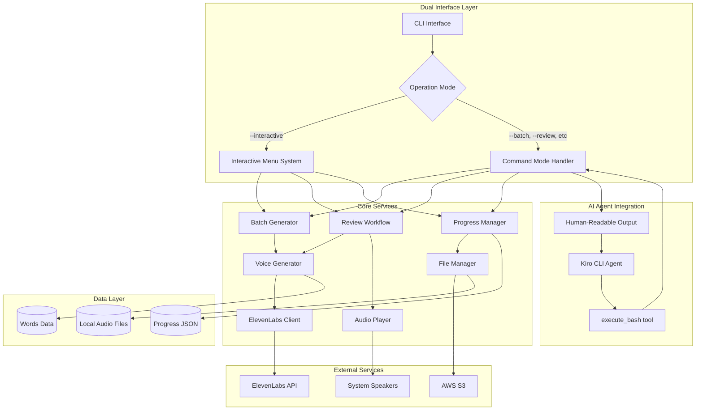

# ElevenLabs Voice Generation Tool - Detailed Design (Updated)

## Overview

This document describes the design for an interactive ElevenLabs voice generation tool that creates high-quality AI voices for all spelling words in the spelling website. The tool supports dual operation modes: rich interactive mode for direct human use, and command-driven mode for AI agent integration via Kiro CLI. It implements a batch generation strategy followed by an interactive quality review process, with comprehensive error handling and progress tracking.

## Detailed Requirements

### Functional Requirements

#### FR1: Voice Generation
- Generate audio for ~230 spelling words using ElevenLabs API
- Support batch generation with primary voice (Rachel) for efficiency
- Generate alternative voices on-demand during review process
- Support 6-voice fallback sequence: Rachel → Dorothy → Emily → Thomas → Antoni → Adam → Return to Rachel

#### FR2: Quality Review Process
- Interactive review workflow with audio playback
- Three review options: Accept (y), Reject/Next Voice (n), Listen Again (l)
- Keep all generated voices available until final decision
- Allow return to primary voice after trying alternatives

#### FR3: Progress Management
- Comprehensive progress tracking with JSON state persistence
- Resume capability from any point in the process
- Support multiple operational modes: all words, resume, new words only, specific word, progress summary
- Track which voice was approved for each word

#### FR4: Error Handling
- Smart retry logic: 3 retries with exponential backoff for transient errors
- Immediate user intervention for authentication errors (invalid API key)
- Rate limit handling with request throttling
- Graceful degradation and progress preservation

#### FR5: File Management
- Local storage of all generated audio files during review
- Batch upload to S3 after completion
- Temporary file cleanup after decisions made
- Support for S3 bucket structure: `{voice_name}/{word_id}.mp3`

#### FR6: Configuration Management
- Configurable ElevenLabs API settings with optimized defaults
- Environment-based configuration (API keys, S3 bucket)
- Voice quality parameters tuned for children's content

#### FR7: Dual Operation Modes (NEW)
- **Interactive Mode:** Rich menu-driven interface for direct human use
- **Command Mode:** Focused commands for AI agent integration via Kiro CLI
- **Hybrid Architecture:** Single executable supporting both modes

#### FR8: AI Agent Integration (NEW)
- Command-line interface optimized for AI agent interaction
- Human-readable output that AI agents can parse
- Automatic audio playback through system speakers
- AI-human collaboration model with clear role separation

### Non-Functional Requirements

#### NFR1: Performance
- Batch generation of 230 words in ~5 minutes
- Instant audio playback during review (pre-generated)
- Efficient API usage with rate limiting compliance

#### NFR2: Reliability
- 99%+ success rate with proper error handling
- Robust progress persistence to handle interruptions
- Comprehensive error logging and user feedback

#### NFR3: Usability
- Clear interactive prompts and status messages
- Simple command-line interface with menu-driven navigation
- Progress indicators during batch operations

#### NFR4: Maintainability
- Modular architecture with clear separation of concerns
- Configurable parameters for easy adjustment
- Extensible design for future voice additions

## Architecture Overview



## Components and Interfaces

### CLI Interface Component

**Responsibility:** Main entry point and dual-mode operation management

```typescript
interface CLIInterface {
  start(): Promise<void>
  parseArguments(args: string[]): CommandConfig
  runInteractiveMode(): Promise<void>
  runCommandMode(config: CommandConfig): Promise<void>
}

interface CommandConfig {
  mode: 'interactive' | 'batch' | 'review' | 'status' | 'upload'
  wordId?: string
  options: CommandOptions
}

interface CommandOptions {
  silent?: boolean
  verbose?: boolean
  jsonOutput?: boolean
}

enum OperationMode {
  Interactive = 'interactive',
  Batch = 'batch',
  Review = 'review', 
  Status = 'status',
  Upload = 'upload'
}
```

### Command Mode Handler Component (NEW)

**Responsibility:** AI agent-friendly command execution with structured output

```typescript
interface CommandModeHandler {
  executeBatch(): Promise<CommandResult>
  executeReview(wordId: string): Promise<CommandResult>
  executeStatus(): Promise<CommandResult>
  executeUpload(): Promise<CommandResult>
}

interface CommandResult {
  success: boolean
  message: string
  data?: any
  nextAction?: string
}
```

### Voice Generator Component

**Responsibility:** ElevenLabs API integration and audio generation

```typescript
interface VoiceGenerator {
  generateBatch(words: Word[], voice: VoiceConfig): Promise<GenerationResult[]>
  generateSingle(word: Word, voice: VoiceConfig): Promise<AudioBuffer>
  getAvailableVoices(): VoiceConfig[]
}

interface VoiceConfig {
  id: string
  name: string
  description: string
}

interface GenerationResult {
  wordId: string
  success: boolean
  audioBuffer?: ArrayBuffer
  error?: string
}
```

### Audio Player Component

**Responsibility:** Cross-platform audio playback with AI agent integration

```typescript
interface AudioPlayer {
  play(audioBuffer: ArrayBuffer): Promise<void>
  playFile(filePath: string): Promise<void>
  isPlaying(): boolean
  stop(): void
  setAutoPlay(enabled: boolean): void
}

interface AudioPlaybackConfig {
  autoPlay: boolean
  platform: 'macos' | 'linux' | 'windows'
  fallbackCommand?: string
}
```

### Progress Manager Component

**Responsibility:** State persistence and progress tracking

```typescript
interface ProgressManager {
  loadProgress(): Promise<ProgressState>
  saveProgress(state: ProgressState): Promise<void>
  getCompletionStatus(): CompletionStatus
  getNewWords(allWords: Word[]): Word[]
}

interface ProgressState {
  completedWords: Map<string, CompletedWord>
  failedWords: string[]
  lastProcessedIndex: number
  sessionStartTime: Date
}

interface CompletedWord {
  wordId: string
  voiceUsed: string
  audioPath: string
  completedAt: Date
}
```

### File Manager Component

**Responsibility:** Local file operations and S3 integration

```typescript
interface FileManager {
  saveAudioFile(wordId: string, voice: string, audioBuffer: ArrayBuffer): Promise<string>
  loadAudioFile(wordId: string, voice: string): Promise<ArrayBuffer>
  uploadToS3(approvedFiles: ApprovedFile[]): Promise<UploadResult[]>
  cleanupTempFiles(wordId: string): Promise<void>
}

interface ApprovedFile {
  wordId: string
  voiceUsed: string
  localPath: string
  s3Key: string
}
```

### ElevenLabs Client Component

**Responsibility:** Low-level API communication with error handling

```typescript
interface ElevenLabsClient {
  generateAudio(text: string, voiceId: string, settings: VoiceSettings): Promise<ArrayBuffer>
  validateApiKey(): Promise<boolean>
  getRateLimits(): Promise<RateLimitInfo>
}

interface VoiceSettings {
  modelId: string
  stability: number
  similarityBoost: number
  style: number
  useSpeakerBoost: boolean
  outputFormat: string
}
```

## Data Models

### Word Model

```typescript
interface Word {
  id: string          // Unique identifier (e.g., "off", "stuff")
  text: string        // The word to be spoken
  year: 1 | 2        // School year level
  category: string    // Phonics category (e.g., "ff", "ll")
}
```

### Configuration Model

```typescript
interface AppConfig {
  elevenlabs: ElevenLabsConfig
  s3: S3Config
  audio: AudioConfig
  voices: VoiceConfig[]
  cli: CLIConfig  // NEW
}

interface CLIConfig {
  defaultMode: 'interactive' | 'command'
  outputFormat: 'human' | 'json'
  autoPlayAudio: boolean
  verboseLogging: boolean
}

interface ElevenLabsConfig {
  apiKey: string
  baseUrl: string
  defaultModel: string
  voiceSettings: VoiceSettings
  rateLimitPerMinute: number
  maxRetries: number
  timeoutSeconds: number
}

interface S3Config {
  bucketName: string
  region: string
  keyPrefix: string
}
```

### Progress Data Model

```typescript
interface ProgressData {
  version: string
  sessionId: string
  startedAt: Date
  lastUpdatedAt: Date
  totalWords: number
  completedCount: number
  failedCount: number
  words: Map<string, WordProgress>
}

interface WordProgress {
  wordId: string
  status: 'pending' | 'completed' | 'failed' | 'skipped'
  voiceUsed?: string
  generatedVoices: string[]  // List of voices generated for this word
  localAudioPath?: string
  s3Uploaded: boolean
  attempts: number
  lastError?: string
  completedAt?: Date
}
```

## Error Handling

### Error Classification

```typescript
enum ErrorType {
  Authentication = 'auth',      // Invalid API key
  RateLimit = 'rate_limit',     // 429 responses
  ServerError = 'server',       // 5XX responses
  Network = 'network',          // Connectivity issues
  Timeout = 'timeout',          // Request timeouts
  Validation = 'validation',    // 422 responses
  FileSystem = 'filesystem',    // Local file operations
  Unknown = 'unknown'
}

interface ErrorHandler {
  handleError(error: Error, context: ErrorContext): Promise<ErrorAction>
  shouldRetry(errorType: ErrorType, attemptCount: number): boolean
  getRetryDelay(attemptCount: number): number
}

enum ErrorAction {
  Retry = 'retry',
  Skip = 'skip', 
  Abort = 'abort',
  UserIntervention = 'user_intervention'
}
```

### Retry Logic

```typescript
class RetryManager {
  private readonly maxRetries = 3
  private readonly baseDelay = 1000 // 1 second
  
  async executeWithRetry<T>(
    operation: () => Promise<T>,
    errorHandler: ErrorHandler,
    context: ErrorContext
  ): Promise<T> {
    let lastError: Error
    
    for (let attempt = 1; attempt <= this.maxRetries + 1; attempt++) {
      try {
        return await operation()
      } catch (error) {
        lastError = error
        const errorType = this.classifyError(error)
        
        if (!errorHandler.shouldRetry(errorType, attempt) || attempt > this.maxRetries) {
          const action = await errorHandler.handleError(error, context)
          if (action === ErrorAction.UserIntervention) {
            // Prompt user for action
            continue
          }
          throw error
        }
        
        const delay = errorHandler.getRetryDelay(attempt)
        await this.sleep(delay)
      }
    }
    
    throw lastError
  }
}
```

## Testing Strategy

### Unit Testing

- **Voice Generator:** Mock ElevenLabs API responses, test error handling
- **Progress Manager:** Test state persistence and recovery scenarios
- **File Manager:** Mock file system operations, test S3 integration
- **Audio Player:** Mock system audio, test cross-platform compatibility
- **Error Handler:** Test retry logic and error classification

### Integration Testing

- **End-to-End Workflow:** Test complete generation and review process
- **API Integration:** Test with real ElevenLabs API (limited scope)
- **S3 Integration:** Test upload and bucket operations
- **Progress Recovery:** Test interruption and resume scenarios

### Manual Testing

- **User Experience:** Test interactive prompts and menu navigation
- **Audio Quality:** Manual review of generated audio samples
- **Error Scenarios:** Test various failure conditions
- **Performance:** Measure batch generation times

## Appendices

### Technology Choices

#### Node.js Runtime
- **Pros:** Excellent async/await support, rich ecosystem, cross-platform
- **Cons:** Single-threaded (not relevant for I/O-bound operations)
- **Decision:** Optimal for API-heavy operations with good library support

#### TypeScript
- **Pros:** Type safety, better IDE support, catches errors at compile time
- **Cons:** Additional build step, learning curve
- **Decision:** Essential for maintainable code with complex data structures

#### Built-in Modules
- **fetch():** Modern HTTP client, built into Node.js 18+
- **readline:** Interactive CLI prompts
- **fs/promises:** Async file operations
- **child_process:** System audio playback

#### Command-Line Interface Design
- **Dual Mode Architecture:** Single executable supporting both interactive and command modes
- **Human-Readable Output:** Natural language output optimized for AI agent parsing
- **Standard Unix Patterns:** Exit codes, command structure, and output formatting follow Unix conventions

### Research Findings

#### ElevenLabs API Reliability
- **Success Rate:** 95-99% with proper retry logic
- **Rate Limits:** 50 req/min (free), 5000+ req/min (paid)
- **Common Failures:** Rate limiting (429), transient server errors (5XX)
- **Built-in Retries:** SDK includes automatic retry with exponential backoff

#### S3 Integration Strategy
- **Same Bucket Approach:** Use existing `spellmatereact` bucket with exclude patterns
- **Deployment Safety:** Exclude `voices/*` from sync operations
- **Structure:** `voices/{voice_name}/{word_id}.mp3`
- **Benefits:** Single bucket management, existing CloudFront distribution

#### Audio Playback Options
- **macOS:** `afplay` (built-in, reliable)
- **Cross-platform:** `mpv`, `vlc` (require installation)
- **Fallback:** Browser-based playback for compatibility

#### Kiro CLI Integration Strategy
- **Hybrid Approach:** Standalone executable called via `execute_bash` tool
- **AI-Human Collaboration:** AI handles automation, human makes quality decisions
- **Command Interface:** Focused commands for specific operations (`--batch`, `--review`, `--status`, `--upload`)
- **Output Format:** Human-readable text that AI agents can easily parse
- **Audio Integration:** Automatic playback through system speakers during review

### Alternative Approaches

#### MCP Server vs Standalone Tool
- **MCP Server Pros:** Persistent state, structured interface, better for complex workflows
- **MCP Server Cons:** More complex setup, server lifecycle management
- **Standalone Tool Pros:** Simpler implementation, direct execution, easier debugging
- **Standalone Tool Cons:** State management via files, independent executions
- **Decision:** Hybrid standalone tool provides best balance of simplicity and functionality

#### JSON vs Human-Readable Output
- **JSON Pros:** Perfect parsing reliability, structured data
- **JSON Cons:** Implementation complexity, less debuggable, rigid format
- **Human-Readable Pros:** AI agents parse well, flexible, debuggable, Unix-style
- **Human-Readable Cons:** Potential parsing ambiguity (minimal with modern AI)
- **Decision:** Human-readable output leverages AI agent strengths while maintaining simplicity
