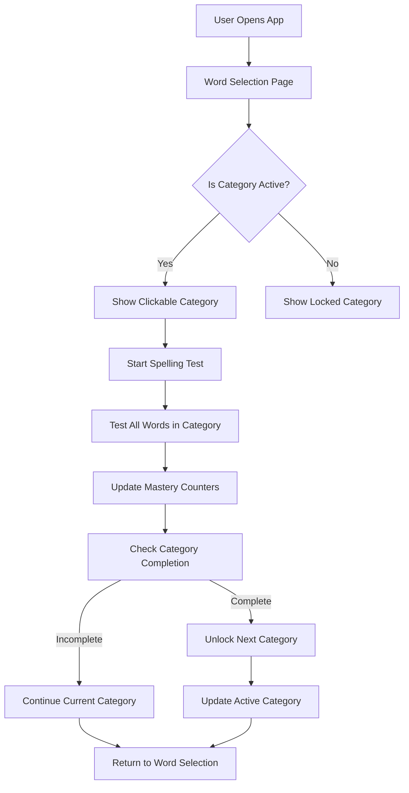

# Mastery Mode - Detailed Design Document

## Overview

This document outlines the design for implementing a mastery-based learning mode in the Spelling Website. The mastery mode replaces the current spelling test system with a focused, repetition-based approach where students practice specific word categories until achieving deep mastery before progressing to the next category.

## Detailed Requirements

### Core Functionality
- **Always Active**: Mastery mode replaces the normal spelling test mode entirely
- **Category Focus**: Students practice all words in a single category until ALL words achieve mastery (15 correct attempts each)
- **Deep Repetition**: Each word requires 15 correct attempts before being considered mastered
- **Sequential Progression**: Categories unlock in sequence only when current category is 100% complete (common words 3 → common words 4 → etc.)
- **Visual Feedback**: Progress indicators show current attempts (e.g., "cat: 8/15")
- **Category Locking**: Current category remains locked and is the only clickable option until all words reach 15/15

### Initial Configuration
- **Starting Category**: "common words 3" (hardcoded)
- **Next Category**: "common words 4" (hardcoded progression)
- **Word Selection**: All words in the active category, tested in order
- **Mastery Threshold**: 15 correct attempts per word
- **Progress Tracking**: Independent counters per word (mistakes don't reset other words)

### User Experience
- **Test Sessions**: Cycle through all words in active category each session
- **Progress Display**: Show "word: X/15" format in word selection interface
- **Results Page**: Unchanged from current system
- **Category Interface**: Locked categories visible but unclickable with lock icons

## Architecture Overview



## Components and Interfaces

### 1. Mastery Progress Tracking

#### Enhanced Progress Data Structure
```typescript
type MasteryProgress = {
  currentActiveCategory: string; // e.g., "common words 3"
  wordMasteryCounters: Record<string, number>; // wordId -> correct attempts count
  completedCategories: string[]; // list of fully mastered categories
};

type EnhancedProgressData = {
  // Existing progress structure
  wordAttempts: Record<string, WordAttempt[]>;
  // New mastery tracking
  masteryProgress: MasteryProgress;
};
```

#### Mastery Logic Functions
```typescript
// Check if a word has achieved mastery
function isWordMastered(wordId: string, masteryProgress: MasteryProgress): boolean {
  return (masteryProgress.wordMasteryCounters[wordId] || 0) >= 15;
}

// Check if entire category is mastered (ALL words must have 15+ correct attempts)
function isCategoryMastered(category: string, words: Word[], masteryProgress: MasteryProgress): boolean {
  return words.every(word => isWordMastered(word.id, masteryProgress));
}

// Get next category in sequence
function getNextCategory(currentCategory: string): string {
  const sequence = ["common words 3", "common words 4", "common words 5", /* etc */];
  const currentIndex = sequence.indexOf(currentCategory);
  return sequence[currentIndex + 1] || currentCategory;
}
```

### 2. Enhanced Word Selection Interface

#### BaseWordSelection Component Modifications
```typescript
interface MasteryModeProps {
  activeCategory: string;
  masteryProgress: MasteryProgress;
  onCategoryClick: (category: string) => void;
}

// Category rendering logic
const renderCategory = (category: string, words: Word[]) => {
  const isActive = category === activeCategory;
  const isLocked = !isActive && !completedCategories.includes(category);
  
  return (
    <div 
      className={`category ${isActive ? 'active' : ''} ${isLocked ? 'locked' : ''}`}
      onClick={isActive ? () => onCategoryClick(category) : undefined}
    >
      {isLocked && <LockIcon />}
      <CategoryHeader category={category} />
      <WordsList words={words} showProgress={isActive} />
    </div>
  );
};
```

#### Progress Display Component
```typescript
const WordProgressDisplay = ({ word, masteryProgress }: { 
  word: Word; 
  masteryProgress: MasteryProgress; 
}) => {
  const currentCount = masteryProgress.wordMasteryCounters[word.id] || 0;
  const isComplete = currentCount >= 15;
  
  return (
    <div className={`word-progress ${isComplete ? 'mastered' : ''}`}>
      <span className="word-text">{word.text}</span>
      <span className="progress-counter">
        {currentCount}/15
      </span>
      {isComplete && <CheckIcon />}
    </div>
  );
};
```

### 3. Modified Spelling Test Logic

#### SpellingTest Component Enhancements
```typescript
interface MasteryTestProps {
  category: string;
  words: Word[];
  masteryProgress: MasteryProgress;
  onComplete: (updatedProgress: MasteryProgress) => void;
}

// Test flow for mastery mode
const runMasteryTest = () => {
  // Always test all words in category, in order
  const wordsToTest = getAllWordsInCategory(category);
  
  // Standard test flow, but with mastery counter updates
  const handleWordComplete = (wordId: string, correct: boolean, attempt: string) => {
    // Record attempt in existing system
    recordAttempt(wordId, correct, attempt);
    
    // Update mastery counter if correct
    if (correct) {
      updateMasteryCounter(wordId);
    }
    
    // Check if category is now complete
    if (isCategoryMastered(category, wordsToTest, masteryProgress)) {
      unlockNextCategory();
    }
  };
};
```

### 4. Progress Provider Enhancements

#### Extended ProgressProvider
```typescript
const ProgressProvider = ({ children }) => {
  const [progress, setProgress] = useState<ProgressData>({});
  const [masteryProgress, setMasteryProgress] = useState<MasteryProgress>({
    currentActiveCategory: "common words 3",
    wordMasteryCounters: {},
    completedCategories: []
  });

  const updateMasteryCounter = (wordId: string) => {
    setMasteryProgress(prev => ({
      ...prev,
      wordMasteryCounters: {
        ...prev.wordMasteryCounters,
        [wordId]: (prev.wordMasteryCounters[wordId] || 0) + 1
      }
    }));
  };

  const unlockNextCategory = () => {
    setMasteryProgress(prev => {
      const nextCategory = getNextCategory(prev.currentActiveCategory);
      return {
        ...prev,
        completedCategories: [...prev.completedCategories, prev.currentActiveCategory],
        currentActiveCategory: nextCategory
      };
    });
  };

  return (
    <ProgressContext.Provider value={{
      progress,
      masteryProgress,
      recordAttempt,
      updateMasteryCounter,
      unlockNextCategory,
      getWordStats,
      refreshProgress
    }}>
      {children}
    </ProgressContext.Provider>
  );
};
```

## Data Models

### Mastery Progress Structure
```typescript
type MasteryProgress = {
  currentActiveCategory: string;
  wordMasteryCounters: Record<string, number>;
  completedCategories: string[];
  lastUpdated: string;
};
```

### Category Progression Configuration
```typescript
const MASTERY_CATEGORY_SEQUENCE = [
  "common words 3",
  "common words 4", 
  "common words 5",
  "common words 6",
  // Add more as needed
];

const MASTERY_CONFIG = {
  requiredCorrectAttempts: 15,
  initialCategory: "common words 3"
};
```

## Error Handling

### Progress Data Integrity
- **Missing Counters**: Default to 0 for any missing word counters
- **Invalid Categories**: Fall back to initial category if current category is invalid
- **Data Corruption**: Validate mastery progress structure on load, reset if corrupted

### Category Progression
- **Missing Next Category**: Stay on current category if next in sequence doesn't exist
- **Premature Unlock**: Validate category completion before allowing progression
- **Rollback Support**: Ability to reset to previous category if needed

### API Failures
- **Save Failures**: Queue mastery progress updates locally, retry on reconnection
- **Load Failures**: Use cached mastery progress, sync when connection restored
- **Conflict Resolution**: Server state takes precedence over local state

## Testing Strategy

### Unit Tests
- **Mastery Logic**: Test word/category mastery detection functions
- **Progress Tracking**: Test counter updates and category progression
- **Data Validation**: Test progress data structure validation
- **Edge Cases**: Test boundary conditions (exactly 15 attempts, category transitions)

### Integration Tests
- **Full Test Flow**: Complete spelling test with mastery counter updates
- **Category Progression**: Test automatic unlock of next category
- **Progress Persistence**: Test save/load of mastery progress
- **UI Integration**: Test locked/unlocked category display

### User Acceptance Tests
- **Learning Flow**: Student completes full category mastery cycle
- **Progress Visibility**: Verify progress counters display correctly
- **Category Locking**: Confirm locked categories are unclickable
- **Progression**: Verify smooth transition to next category

## Appendices

### Technology Choices

#### State Management
- **React Context**: Continue using existing ProgressProvider pattern
- **Local Storage**: Cache mastery progress for offline resilience
- **API Integration**: Extend existing progress API with mastery endpoints

#### UI Components
- **Existing Components**: Reuse BaseWordSelection, SpellingTest components
- **New Components**: WordProgressDisplay, CategoryLockIndicator
- **Styling**: Extend existing CSS classes for mastery-specific states

### Research Findings

#### Current System Analysis
- **Progress Tracking**: Existing WordAttempt structure supports mastery tracking
- **Word Selection**: Current priority-based selection can be overridden for mastery mode
- **Test Flow**: Existing SpellingTest component can be enhanced rather than replaced
- **Authentication**: No admin controls needed for initial implementation

#### Implementation Complexity
- **Low Risk**: Additive changes to existing components
- **Backward Compatible**: Existing progress data preserved
- **Minimal API Changes**: Extend existing endpoints rather than create new ones

### Alternative Approaches

#### Admin-Controlled Progression
- **Considered**: Manual admin approval for category advancement
- **Rejected**: Added complexity without clear benefit for single-user scenario
- **Future Option**: Could be added later if multi-user scenarios emerge

#### Configurable Mastery Thresholds
- **Considered**: Variable mastery requirements per category
- **Rejected**: Hardcoded 15 attempts sufficient for initial implementation
- **Future Option**: Could be made configurable through settings

#### Cross-Category Word Selection
- **Considered**: Mixing words from multiple categories
- **Rejected**: Category-focused approach provides clearer learning structure
- **Future Option**: Advanced mode could support mixed categories

## Implementation Notes

### Phase 1: Core Mastery Logic
1. Extend ProgressProvider with mastery tracking
2. Implement mastery detection functions
3. Add mastery counter updates to test flow

### Phase 2: UI Enhancements
1. Add progress display to word selection interface
2. Implement category locking visual indicators
3. Update category click handlers for mastery mode

### Phase 3: Category Progression
1. Implement automatic category unlocking
2. Add category sequence configuration
3. Test full progression flow

### Phase 4: Polish and Testing
1. Add comprehensive test coverage
2. Implement error handling and edge cases
3. Performance optimization and cleanup

This design provides a clear roadmap for implementing the mastery mode feature while maintaining the existing system's stability and user experience.
