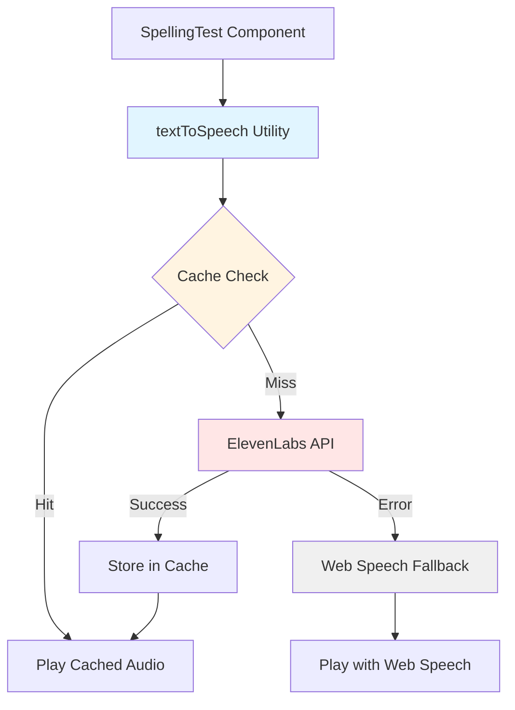
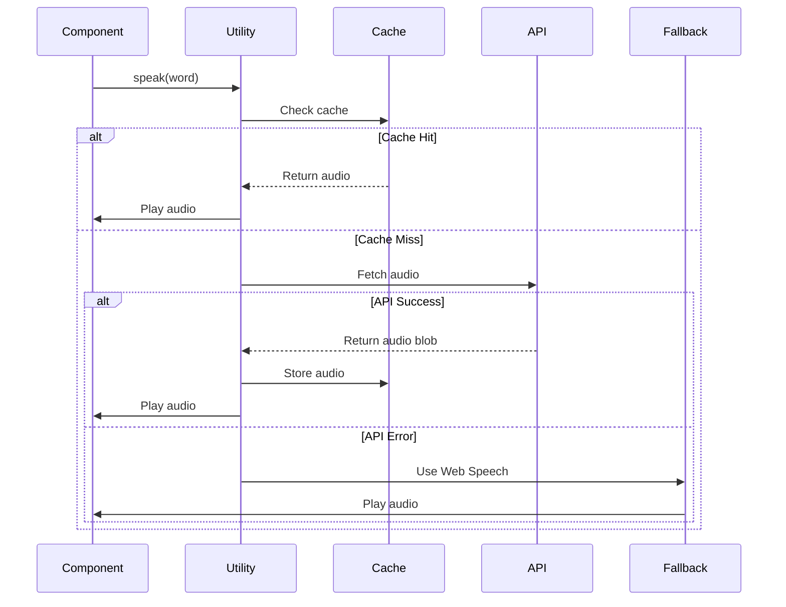
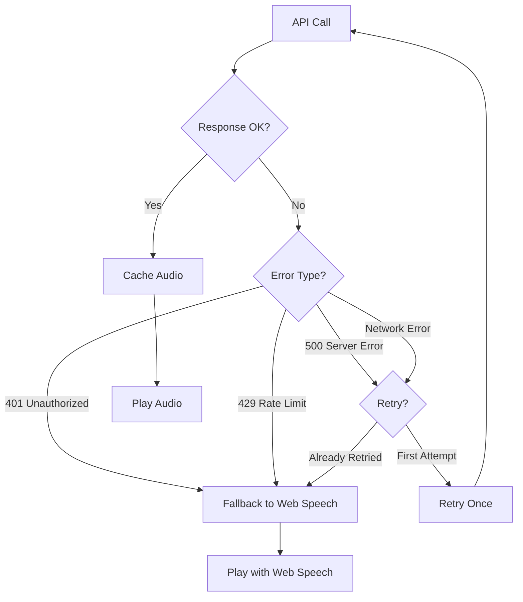

# ElevenLabs Voices Feature - Detailed Design

## Overview

This document describes the design for integrating ElevenLabs text-to-speech API to replace the browser's Web Speech API, providing higher quality, more natural voices for word pronunciation in spelling tests.

## Detailed Requirements

### Functional Requirements

1. **ElevenLabs Integration**
   - Replace Web Speech API with ElevenLabs API for word pronunciation
   - Use child-friendly British English voice (Rachel or Bella)
   - Maintain same user experience (automatic + manual playback)

2. **Fallback Mechanism**
   - Automatically fall back to Web Speech API if ElevenLabs fails
   - Fallback should be transparent to user
   - Retry once on network errors before falling back

3. **Audio Caching**
   - Cache all generated audio in IndexedDB
   - Check cache before making API calls
   - Cache key: word text + voice ID
   - Persistent across sessions

4. **Loading States**
   - Disable "Listen" button while fetching audio
   - Show "Loading..." text on button
   - Re-enable once audio starts playing

5. **Error Handling**
   - Handle network errors gracefully
   - Handle API errors (401, 429, 500) gracefully
   - Log errors to console in development
   - Never interrupt user experience

### Non-Functional Requirements

1. **Performance:** Cached audio should play instantly
2. **Reliability:** Always works (fallback ensures this)
3. **Cost:** Minimize API calls through aggressive caching
4. **Maintainability:** Reusable utility that can be used across components
5. **Security:** API key stored in environment variable

## Architecture Overview



### Component Integration

The TTS functionality will be extracted into a reusable utility module that can be used by any component.

## Components and Interfaces

### New Utility Module: `src/utils/textToSpeech.ts`

```typescript
// Types
interface TextToSpeechOptions {
  voiceId?: string;
  useCache?: boolean;
  onLoading?: (loading: boolean) => void;
}

interface CachedAudio {
  word: string;
  voiceId: string;
  audioBlob: Blob;
  timestamp: number;
}

// Main function
export async function speak(
  text: string,
  options?: TextToSpeechOptions
): Promise<void>;

// Cache management
export async function getCachedAudio(
  word: string,
  voiceId: string
): Promise<Blob | null>;

export async function cacheAudio(
  word: string,
  voiceId: string,
  audioBlob: Blob
): Promise<void>;

// Fallback function
function speakWithWebSpeech(text: string): void;

// ElevenLabs API client
async function fetchElevenLabsAudio(
  text: string,
  voiceId: string,
  apiKey: string
): Promise<Blob>;
```

### Modified Component: SpellingTest.tsx

**Changes:**
1. Import new utility
2. Replace `speak()` function call
3. Add loading state for "Listen" button
4. Update button to show loading state

**New State:**
```typescript
const [isLoadingAudio, setIsLoadingAudio] = useState(false);
```

**Modified Function:**
```typescript
// Old
function speak(text: string) {
  window.speechSynthesis.cancel();
  const utterance = new window.SpeechSynthesisUtterance(text);
  window.speechSynthesis.speak(utterance);
}

// New - Remove inline function, use utility
import { speak as speakWord } from '../utils/textToSpeech';

// Update usage
const handleSpeak = async () => {
  setIsLoadingAudio(true);
  try {
    await speakWord(currentWord, {
      onLoading: setIsLoadingAudio,
    });
  } finally {
    setIsLoadingAudio(false);
  }
};
```

**Modified JSX:**
```tsx
<button 
  className="spelling-listen-btn" 
  onClick={handleSpeak}
  disabled={isLoadingAudio}
>
  {isLoadingAudio ? 'Loading...' : '🔊 Listen to the word'}
</button>
```

**Automatic Playback:**
```typescript
// Update useEffect
useEffect(() => {
  if (wordToUtter) {
    speakWord(wordToUtter); // No loading state for automatic playback
    setWordToUtter(null);
  }
}, [wordToUtter]);
```

### IndexedDB Cache Implementation

**Database Schema:**
- **Database Name:** `spellingWebsite`
- **Store Name:** `audioCache`
- **Key Path:** `word_voiceId` (composite key)
- **Indexes:** `word`, `voiceId`, `timestamp`

**Cache Entry:**
```typescript
{
  word_voiceId: "hello_21m00Tcm4TlvDq8ikWAM",
  word: "hello",
  voiceId: "21m00Tcm4TlvDq8ikWAM",
  audioBlob: Blob,
  timestamp: 1234567890
}
```

## Data Models

### Environment Variables

```bash
# .env
VITE_ELEVENLABS_API_KEY=your_api_key_here
VITE_ELEVENLABS_VOICE_ID=21m00Tcm4TlvDq8ikWAM  # Optional, has default
```

### Configuration

```typescript
// src/utils/textToSpeech.ts
const DEFAULT_VOICE_ID = '21m00Tcm4TlvDq8ikWAM'; // Rachel
const ELEVENLABS_API_URL = 'https://api.elevenlabs.io/v1/text-to-speech';
const CACHE_DB_NAME = 'spellingWebsite';
const CACHE_STORE_NAME = 'audioCache';
```

## Workflows

### Main TTS Workflow



### Error Handling Workflow



## Error Handling

### Error Types and Handling

1. **Network Errors**
   - **Detection:** `fetch` throws or returns non-ok status
   - **Action:** Retry once, then fallback
   - **User Impact:** None (transparent fallback)

2. **401 Unauthorized**
   - **Detection:** Response status 401
   - **Action:** Immediate fallback (no retry)
   - **User Impact:** None (uses Web Speech)

3. **429 Rate Limit**
   - **Detection:** Response status 429
   - **Action:** Immediate fallback (no retry)
   - **User Impact:** None (uses Web Speech)

4. **500 Server Error**
   - **Detection:** Response status 500
   - **Action:** Retry once, then fallback
   - **User Impact:** None (transparent fallback)

5. **Invalid Response**
   - **Detection:** Response is not audio blob
   - **Action:** Fallback immediately
   - **User Impact:** None (uses Web Speech)

### Error Logging

```typescript
if (import.meta.env.DEV) {
  console.error('ElevenLabs TTS error:', error);
  console.log('Falling back to Web Speech API');
}
```

## Testing Strategy

### Unit Tests

1. **Cache Management**
   - Test cache storage
   - Test cache retrieval
   - Test cache miss handling

2. **API Client**
   - Mock fetch API
   - Test successful requests
   - Test error responses
   - Test retry logic

3. **Fallback Logic**
   - Test fallback on API errors
   - Test fallback on network errors
   - Test Web Speech API call

4. **Audio Playback**
   - Mock Audio API
   - Test audio URL creation
   - Test cleanup

### Integration Tests

1. **Full Flow**
   - Test cache hit path
   - Test cache miss → API → cache path
   - Test error → fallback path

2. **Component Integration**
   - Test SpellingTest integration
   - Test loading states
   - Test button behavior

### Manual Testing

1. **Happy Path**
   - Play word (first time - API call)
   - Play same word again (cached)
   - Verify audio quality

2. **Error Scenarios**
   - Disable network → Verify fallback
   - Invalid API key → Verify fallback
   - Check console for errors

3. **Performance**
   - First play: ~200-500ms delay
   - Cached play: Instant
   - Verify no UI blocking

## Implementation Details

### IndexedDB Setup

```typescript
async function openCacheDB(): Promise<IDBDatabase> {
  return new Promise((resolve, reject) => {
    const request = indexedDB.open(CACHE_DB_NAME, 1);
    
    request.onerror = () => reject(request.error);
    request.onsuccess = () => resolve(request.result);
    
    request.onupgradeneeded = (event) => {
      const db = (event.target as IDBOpenDBRequest).result;
      if (!db.objectStoreNames.contains(CACHE_STORE_NAME)) {
        const store = db.createObjectStore(CACHE_STORE_NAME, {
          keyPath: 'word_voiceId',
        });
        store.createIndex('word', 'word', { unique: false });
        store.createIndex('voiceId', 'voiceId', { unique: false });
        store.createIndex('timestamp', 'timestamp', { unique: false });
      }
    };
  });
}
```

### Audio Playback

```typescript
async function playAudioBlob(blob: Blob): Promise<void> {
  return new Promise((resolve, reject) => {
    const audioUrl = URL.createObjectURL(blob);
    const audio = new Audio(audioUrl);
    
    audio.onended = () => {
      URL.revokeObjectURL(audioUrl);
      resolve();
    };
    
    audio.onerror = (error) => {
      URL.revokeObjectURL(audioUrl);
      reject(error);
    };
    
    audio.play().catch(reject);
  });
}
```

### API Client

```typescript
async function fetchElevenLabsAudio(
  text: string,
  voiceId: string,
  apiKey: string
): Promise<Blob> {
  const response = await fetch(
    `${ELEVENLABS_API_URL}/${voiceId}`,
    {
      method: 'POST',
      headers: {
        'xi-api-key': apiKey,
        'Content-Type': 'application/json',
      },
      body: JSON.stringify({
        text: text,
        model_id: 'eleven_monolingual_v1',
        voice_settings: {
          stability: 0.5,
          similarity_boost: 0.5,
        },
      }),
    }
  );

  if (!response.ok) {
    throw new Error(`ElevenLabs API error: ${response.status}`);
  }

  return await response.blob();
}
```

## Files to Create/Modify

### New Files
- `src/utils/textToSpeech.ts` - Main TTS utility
- `.env.example` - Environment variable template
- `.sop/planning-elevenlabs-voices/` - Planning documents

### Modified Files
- `src/pages/SpellingTest.tsx` - Use new utility
- `.gitignore` - Ensure `.env` is ignored
- `README.md` - Document environment variables

### Configuration
- Environment variables in `.env` (not committed)

## Constraints and Limitations

1. **API Key Exposure:** API key will be visible in frontend bundle (acceptable for TTS)
2. **Network Dependency:** Requires internet for first play (mitigated by caching)
3. **Browser Support:** IndexedDB supported in all modern browsers
4. **Cost:** API usage costs money (mitigated by caching)
5. **Rate Limits:** API has rate limits (handled with fallback)

## Success Criteria

✅ ElevenLabs API integrated and working  
✅ Automatic fallback to Web Speech API on errors  
✅ Audio caching in IndexedDB working  
✅ Loading states on "Listen" button  
✅ No user-facing errors (all handled gracefully)  
✅ Cached audio plays instantly  
✅ First-time audio plays within 500ms  
✅ Works on desktop and mobile browsers  
✅ No console errors in production  
✅ API costs minimized through caching  

## Future Enhancements

1. **Voice Selection:** Allow users to choose voice
2. **Cache Management:** Add UI to clear cache
3. **Analytics:** Track API usage and costs
4. **Offline Mode:** Better offline experience
5. **Multiple Voices:** Different voices for different word lists

