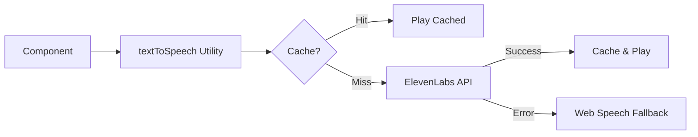

# ElevenLabs Voices Feature - Project Summary

## Overview

This project integrates ElevenLabs text-to-speech API to replace the browser's Web Speech API, providing higher quality, more natural voices for word pronunciation in spelling tests. The implementation includes automatic fallback to Web Speech API for reliability, persistent audio caching to reduce API costs, and loading states for better user experience.

## Directory Structure

```
.sop/planning-elevenlabs-voices/
├── rough-idea.md (initial concept)
├── idea-honing.md (requirements clarification Q&A)
├── research/
│   ├── current-tts-implementation.md (analysis of existing TTS)
│   └── elevenlabs-api.md (ElevenLabs API research)
├── design/
│   └── detailed-design.md (comprehensive design document)
├── implementation/
│   └── plan.md (6-step implementation plan with checklist)
└── summary.md (this document)
```

## Key Design Elements

### User Experience
- **Seamless integration:** Same automatic and manual playback as before
- **Loading feedback:** "Listen" button shows "Loading..." while fetching
- **Transparent fallback:** Errors automatically fall back to Web Speech API
- **Performance:** Cached audio plays instantly

### Technical Implementation
- **Reusable utility:** `src/utils/textToSpeech.ts` can be used across components
- **Persistent caching:** IndexedDB stores audio for offline and repeated use
- **Error resilience:** Multiple error handling layers with automatic fallback
- **Environment-based:** API key stored in environment variables

### Architecture


## Implementation Approach

The implementation is broken down into 6 incremental steps:

1. **Environment setup** - Configure API keys and environment variables
2. **Core utility** - Create textToSpeech module with ElevenLabs integration
3. **Caching** - Add IndexedDB persistent caching
4. **Integration** - Replace existing speak() function in SpellingTest
5. **Loading states** - Add UX improvements with loading indicators
6. **Testing** - Comprehensive testing and refinement

Each step builds on the previous one and results in working, testable functionality.

## Key Requirements

### Functional
- ✅ Replace Web Speech API with ElevenLabs API
- ✅ Automatic fallback to Web Speech API on errors
- ✅ Persistent audio caching in IndexedDB
- ✅ Loading states on "Listen" button
- ✅ Same user experience (automatic + manual playback)
- ✅ Works in all browsers (via fallback)

### Non-Functional
- ✅ Performance: Cached audio plays instantly
- ✅ Reliability: Always works (fallback ensures this)
- ✅ Cost: Minimized through aggressive caching
- ✅ Maintainability: Reusable utility module
- ✅ Security: API key in environment variables

## Research Findings

### Current Implementation
- Uses simple `window.speechSynthesis` API
- Inline function in SpellingTest component
- No error handling or caching
- Voice quality varies by browser/device

### ElevenLabs API
- REST API with POST endpoint
- Returns MP3 audio blob
- Requires API key in headers
- Rate limits apply (10 req/sec typical)
- Cost: Character-based pricing

**Key Insight:** Can create seamless upgrade with fallback, ensuring reliability while providing better quality when available.

## Next Steps

### To Begin Implementation

1. **Get ElevenLabs API key:**
   - Sign up at https://elevenlabs.io
   - Get API key from dashboard
   - Choose voice (recommended: Rachel or Bella)

2. **Review the detailed design:** `.sop/planning-elevenlabs-voices/design/detailed-design.md`
3. **Follow the implementation plan:** `.sop/planning-elevenlabs-voices/implementation/plan.md`
4. **Use the checklist:** Track progress with the checklist at the top of plan.md

### Implementation Order

Start with Step 1 (environment setup) and proceed sequentially through Step 6 (testing). Each step is designed to be independently testable and builds incrementally toward the complete feature.

### Testing Strategy

- **Unit tests:** Mock API calls, test caching, test error handling
- **Integration tests:** Test full flow with real API (limited)
- **Manual testing:** Test on multiple browsers and devices
- **Error testing:** Test fallback behavior with network failures

## Design Decisions

### Why ElevenLabs with fallback?
Provides better quality when available, but ensures reliability through fallback. Best of both worlds.

### Why IndexedDB caching?
Persistent storage across sessions reduces API calls and costs. Words are repeated frequently, so caching is highly effective.

### Why loading states?
Provides user feedback during network requests. First play has ~200-500ms delay, so feedback is important.

### Why reusable utility?
Can be used in other components (PracticePage, etc.) in the future. Better code organization.

### Why environment variables?
Standard practice for API keys. Keeps secrets out of code repository.

## Files to Create/Modify

### New Files
- `src/utils/textToSpeech.ts` - Main TTS utility
- `.env.example` - Environment variable template
- `.sop/planning-elevenlabs-voices/` - Planning documents

### Modified Files
- `src/pages/SpellingTest.tsx` - Use new utility
- `.gitignore` - Ensure `.env` is ignored (if not already)
- `README.md` - Document environment variables

### Configuration
- `.env` file (not committed, user creates from `.env.example`)

## Estimated Effort

- **Environment setup:** 15 minutes
- **Core utility:** 1-2 hours
- **Caching:** 1-2 hours
- **Integration:** 30 minutes
- **Loading states:** 45 minutes
- **Testing:** 1-2 hours
- **Total:** 4.5-7 hours

## Success Criteria

✅ ElevenLabs API integrated and working  
✅ Automatic fallback to Web Speech API on errors  
✅ Audio caching in IndexedDB working  
✅ Loading states on "Listen" button  
✅ No user-facing errors (all handled gracefully)  
✅ Cached audio plays instantly  
✅ First-time audio plays within 500ms  
✅ Works on desktop and mobile browsers  
✅ No console errors in production  
✅ API costs minimized through caching  

## Cost Considerations

### ElevenLabs Pricing
- **Free tier:** 10,000 characters/month
- **Paid tiers:** ~$5/month for 30,000 characters
- **Average word:** ~5 characters
- **1,000 words:** ~5,000 characters

### Cost Mitigation
- **Aggressive caching:** Same word = same audio (cached)
- **Persistent cache:** Works across sessions
- **Selective use:** Only for spelling tests

### Monitoring
- Monitor usage in ElevenLabs dashboard
- Track cache hit rates
- Adjust caching strategy if needed

## Questions or Concerns?

Refer to:
- **Design details:** `design/detailed-design.md`
- **Implementation steps:** `implementation/plan.md`
- **Research findings:** `research/` directory
- **Requirements:** `idea-honing.md`

All documentation is designed to be self-contained and comprehensive for implementation.

## Related Issues

- GitHub Issue #4: https://github.com/getOffIt/spellingWebsite/issues/4

