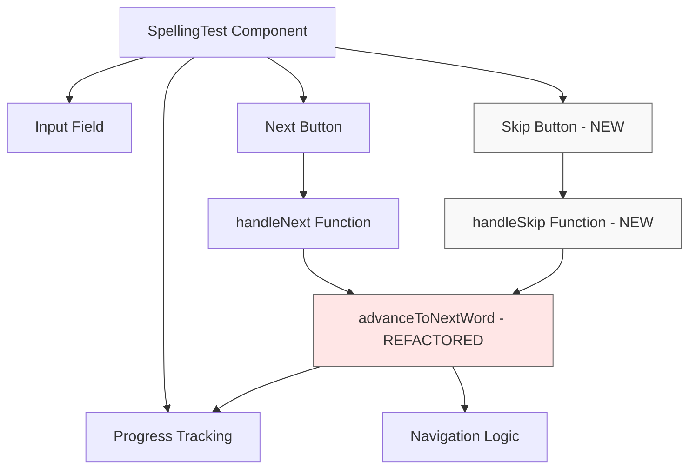
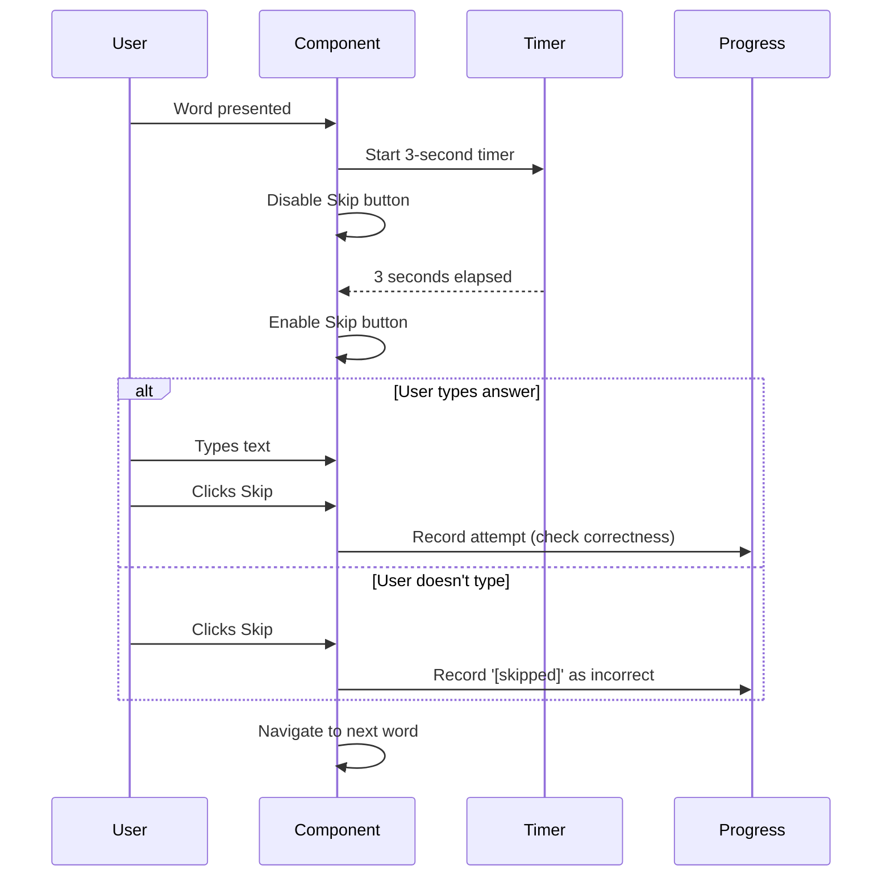

# Skip Button Feature - Detailed Design

## Overview

This document describes the design for adding a Skip button to the Spelling Test component. The feature allows Leo to skip words he doesn't know, preventing him from getting stuck during practice. Skipped words are recorded as failed attempts in the progress tracking system.

## Detailed Requirements

### Functional Requirements

1. **Skip Button Presence**
   - A Skip button must be available on every word in the spelling test
   - The button must be visible and accessible throughout the test

2. **Button Behavior**
   - Skip button is disabled for the first 3 seconds after each word is presented
   - After 3 seconds, the button becomes enabled regardless of input field state
   - When clicked with text in input field: records the text and checks correctness (same as Next button)
   - When clicked with empty input field: records `'[skipped]'` as the answer and marks as incorrect

3. **Visual Design**
   - Style: Secondary/muted appearance (gray background)
   - Placement: Below the Next button
   - Size: To be determined during implementation
   - Must be visually distinct from the primary Next button

4. **Progress Tracking**
   - All skip actions must be recorded using the existing `recordAttempt` function
   - Skipped words (empty input) count as failed attempts
   - Partial answers submitted via Skip are checked for correctness

5. **Navigation**
   - Skip button follows the same navigation logic as Next button
   - Advances to next word or triggers stage transitions appropriately
   - Works in both practice and full_test modes

### Non-Functional Requirements

1. **Consistency**: Skip button behavior must be consistent with existing Next button patterns
2. **Accessibility**: Button must be easily accessible on mobile/iPad devices
3. **Performance**: No performance impact from timer implementation
4. **Maintainability**: Code should reuse existing navigation logic

## Architecture Overview

The Skip button integrates into the existing SpellingTest component architecture:



### Component Integration

The Skip button will be added to the SpellingTest component alongside the existing Next button. Both buttons will share common navigation logic through a refactored helper function.

## Components and Interfaces

### Modified Component: SpellingTest.tsx

**New State:**
```typescript
const [skipEnabled, setSkipEnabled] = useState(false);
```

**New Effect:**
```typescript
useEffect(() => {
  // Disable skip button when word changes
  setSkipEnabled(false);
  
  // Enable skip button after 3 seconds
  const timer = setTimeout(() => {
    setSkipEnabled(true);
  }, 3000);
  
  return () => clearTimeout(timer);
}, [step, currentStage]);
```

**Refactored Function:**
```typescript
const advanceToNextWord = (userAttempt: string) => {
  const currentWord = wordsForCurrentStage[step];
  const isCorrect = userAttempt.trim().toLowerCase() === currentWord.toLowerCase();
  
  // Record attempt using existing hook
  const { recordAttempt } = (currentStage === 'base' && listType === 'less_family')
    ? baseWordHooks[currentWord]
    : wordHooks[currentWord];
  recordAttempt(currentWord, isCorrect, userAttempt);
  
  // Navigation logic (existing code from handleNext)
  if (step === wordsForCurrentStage.length - 1) {
    // Handle stage transitions and results
    // ... existing logic ...
  } else {
    setStep(step + 1);
  }
};
```

**Modified Function:**
```typescript
const handleNext = () => {
  advanceToNextWord(answers[step]);
};
```

**New Function:**
```typescript
const handleSkip = () => {
  const userAttempt = answers[step] || '[skipped]';
  advanceToNextWord(userAttempt);
};
```

**New JSX:**
```tsx
<button className="spelling-btn" onClick={handleNext} disabled={!answers[step]}>
  {/* existing dynamic label logic */}
</button>
<button 
  className="spelling-skip-btn" 
  onClick={handleSkip} 
  disabled={!skipEnabled}
>
  Skip
</button>
```

### New CSS: SpellingTest.css

```css
.spelling-skip-btn {
  display: block;
  margin: 0.75rem auto 0 auto;
  background: #9ca3af;
  color: #fff;
  font-size: 1rem;
  border: none;
  border-radius: 10px;
  padding: 0.6rem 2rem;
  cursor: pointer;
  box-shadow: 0 2px 4px rgba(0,0,0,0.08);
  transition: background 0.2s;
  text-align: center;
}

.spelling-skip-btn:disabled {
  background: #d1d5db;
  cursor: not-allowed;
  opacity: 0.6;
}

.spelling-skip-btn:hover:not(:disabled) {
  background: #6b7280;
}
```

## Data Models

### Skip Marker

**Constant:**
```typescript
const SKIP_MARKER = '[skipped]';
```

**Usage:**
- Stored in `answers` array when Skip is clicked with empty input
- Recorded via `recordAttempt` function as the user's attempt
- Will be marked as incorrect (doesn't match any valid word)

### State Changes

**Existing State (no changes):**
- `step`: Current word index
- `answers`: Array of user attempts
- `currentStage`: 'base' or 'full'
- `showResults`: Boolean for results display

**New State:**
- `skipEnabled`: Boolean indicating if Skip button is enabled

## Workflows

### Skip Button Workflow



### Integration with Existing Flow

```mermaid
flowchart TD
    A[Word Presented] --> B[Start 3s Timer]
    B --> C{User Action?}
    
    C -->|Types & clicks Next| D[handleNext]
    C -->|Clicks Skip after 3s| E[handleSkip]
    
    D --> F[advanceToNextWord with answer]
    E --> G{Input empty?}
    
    G -->|Yes| H[advanceToNextWord with '[skipped]']
    G -->|No| F
    
    F --> I[Record Attempt]
    H --> I
    
    I --> J[Check Correctness]
    J --> K[Navigate]
    
    K --> L{More words?}
    L -->|Yes| A
    L -->|No| M[Show Results]
```

## Error Handling

### Timer Cleanup

**Issue:** Timer must be cleaned up when component unmounts or word changes
**Solution:** Return cleanup function from useEffect

```typescript
useEffect(() => {
  const timer = setTimeout(() => setSkipEnabled(true), 3000);
  return () => clearTimeout(timer);
}, [step, currentStage]);
```

### Edge Cases

1. **Rapid clicking:** Skip button disabled state prevents double-submission
2. **Stage transitions:** Timer resets when moving between base/full stages
3. **Empty input with Skip:** Explicitly handled with `'[skipped]'` marker
4. **Partial input with Skip:** Treated as normal answer submission

## Testing Strategy

### Unit Tests

1. **Timer Behavior**
   - Skip button starts disabled
   - Skip button enables after 3 seconds
   - Timer resets when word changes

2. **Skip with Empty Input**
   - Records `'[skipped]'` as attempt
   - Marks as incorrect
   - Advances to next word

3. **Skip with Partial Input**
   - Records actual input text
   - Checks correctness properly
   - Advances to next word

4. **Navigation**
   - Skip advances through words correctly
   - Skip handles stage transitions
   - Skip works in both test modes

### Integration Tests

1. **Full Test Flow**
   - Complete test using only Skip button
   - Mix of Next and Skip buttons
   - Verify all attempts recorded correctly

2. **Results Display**
   - Skipped words appear in results
   - `'[skipped]'` marker displays appropriately
   - Progress tracking reflects skipped attempts

### Manual Testing

1. **Visual Design**
   - Button appears below Next button
   - Muted/secondary styling is clear
   - Disabled state is visually distinct

2. **User Experience**
   - 3-second delay feels appropriate
   - Button is easily accessible on iPad
   - Behavior is intuitive for Leo

## Appendices

### Technology Choices

**React Hooks:**
- `useState` for skipEnabled state
- `useEffect` for timer management
- Existing `useWord` hook for progress tracking

**Timer Implementation:**
- `setTimeout` for 3-second delay
- Cleanup function to prevent memory leaks
- Resets on word change via dependency array

### Research Findings

From `research/next-button-implementation.md`:

1. **Existing Pattern:** Next button uses `handleNext()` which records attempts and manages navigation
2. **Progress Tracking:** Uses `recordAttempt(wordId, correct, attempt)` from `useWord` hook
3. **Navigation Logic:** Complex stage transitions already implemented
4. **Styling:** Consistent button styling with `.spelling-btn` class

**Key Insight:** Skip button can reuse almost all existing logic by extracting common navigation code into `advanceToNextWord()` helper function.

### Alternative Approaches Considered

1. **Always-enabled Skip button**
   - Pros: Simpler implementation, no timer needed
   - Cons: Doesn't encourage Leo to try first
   - Decision: Rejected in favor of 3-second delay

2. **Skip records empty string instead of marker**
   - Pros: Simpler data model
   - Cons: Can't distinguish skip from accidental empty submission
   - Decision: Rejected in favor of explicit `'[skipped]'` marker

3. **Skip always marks as incorrect regardless of input**
   - Pros: Simpler logic
   - Cons: Unfair if Leo typed correct answer before clicking Skip
   - Decision: Rejected in favor of checking correctness

### Constraints and Limitations

1. **Timer Precision:** 3-second delay is approximate (JavaScript setTimeout)
2. **Mobile Considerations:** Button must be easily tappable on touch devices
3. **Backward Compatibility:** Must work with existing progress tracking system
4. **No Visual Timer:** No countdown display (keeps UI simple)

### Implementation Notes

1. **Code Location:** All changes in `src/pages/SpellingTest.tsx` and `src/pages/SpellingTest.css`
2. **No API Changes:** Uses existing `recordAttempt` function
3. **No Database Changes:** `'[skipped]'` is just a string value
4. **Minimal Refactoring:** Extract `advanceToNextWord()` helper, rest stays same
