# Next Button Implementation Research

## Overview

This document analyzes how the Next button is currently implemented in the SpellingTest component to inform the design of the Skip button feature.

## Component Location

**File:** `src/pages/SpellingTest.tsx`  
**Styling:** `src/pages/SpellingTest.css`

## Current Next Button Implementation

### Button Rendering

```tsx
<button className="spelling-btn" onClick={handleNext} disabled={!answers[step]}>
  {step === wordsForCurrentStage.length - 1 
    ? (currentStage === 'base' && listType === 'less_family' ? 'Next Stage' : 'See Results') 
    : 'Next'}
</button>
```

**Key Characteristics:**
- Uses `spelling-btn` CSS class
- Disabled when input is empty (`!answers[step]`)
- Dynamic label based on position and stage:
  - "Next" for intermediate words
  - "Next Stage" when completing base words in less_family mode
  - "See Results" when completing the final stage
- Triggers `handleNext()` on click

### Button Styling

```css
.spelling-btn {
  display: block;
  margin: 1.5rem auto 0 auto;
  background: #60a5fa;
  color: #fff;
  font-size: 1.1rem;
  border: none;
  border-radius: 10px;
  padding: 0.7rem 2.2rem;
  cursor: pointer;
  box-shadow: 0 2px 4px rgba(0,0,0,0.08);
  transition: background 0.2s;
  text-align: center;
}

.spelling-btn:disabled {
  background: #a1c4fd;
  cursor: not-allowed;
}

.spelling-btn:hover:not(:disabled) {
  background: #2563eb;
}
```

**Styling Features:**
- Blue color scheme (#60a5fa)
- Centered with auto margins
- Rounded corners (10px)
- Subtle shadow
- Hover effect (darker blue #2563eb)
- Disabled state (lighter blue #a1c4fd)

### handleNext Function Logic

The `handleNext()` function performs the following operations:


**Key Operations:**

1. **Record Attempt:**
   ```tsx
   const currentWord = wordsForCurrentStage[step];
   const userAttempt = answers[step];
   const isCorrect = userAttempt.trim().toLowerCase() === currentWord.toLowerCase();
   const { recordAttempt } = (currentStage === 'base' && listType === 'less_family')
     ? baseWordHooks[currentWord]
     : wordHooks[currentWord];
   recordAttempt(currentWord, isCorrect, userAttempt);
   ```

2. **Progress Tracking:**
   - Uses `useWord` hook to get `recordAttempt` function
   - Records whether answer was correct
   - Stores the actual user attempt

3. **Navigation Logic:**
   - Checks if it's the last word in current stage
   - Handles stage transitions for 'less_family' lists
   - Differentiates between 'practice' and 'full_test' modes
   - Shows appropriate results or congratulations

### State Management

**Relevant State Variables:**
```tsx
const [step, setStep] = useState(0);
const [answers, setAnswers] = useState<string[]>(Array(wordsForCurrentStage.length).fill(''));
const [showResults, setShowResults] = useState(false);
const [showPractice, setShowPractice] = useState(false);
const [done, setDone] = useState(false);
const [currentStage, setCurrentStage] = useState<'base' | 'full'>(
  listType === 'less_family' ? 'base' : 'full'
);
```

### Progress Recording Integration

**Hook Usage:**
```tsx
// Build hook maps at the top level
const wordHooks = words.reduce((acc, word) => {
  acc[word] = useWord(word);
  return acc;
}, {} as Record<string, ReturnType<typeof useWord>>);

const baseWordHooks = baseWords.reduce((acc, word) => {
  acc[word] = useWord(word);
  return acc;
}, {} as Record<string, ReturnType<typeof useWord>>);
```

**recordAttempt Function:**
- Part of the `useWord` hook
- Parameters: `(wordId: string, correct: boolean, attempt: string)`
- Updates progress tracking system
- Affects word status (mastered/in-progress/not-started)

## Keyboard Support

The Next button can also be triggered via Enter key:

```tsx
const handleKeyDown = (e: React.KeyboardEvent<HTMLInputElement>) => {
  if (e.key === 'Enter' && answers[step]) {
    handleNext();
  }
};
```

## UI Layout

```mermaid
graph TB
    A[Spelling Test Container] --> B[Title: 🚀 Spelling Test 🚀]
    A --> C[Progress: Base/Full Words - Word X of Y]
    A --> D[Listen Button: 🔊 Listen to the word]
    A --> E[Input Field]
    A --> F[Next Button]
    
    style F fill:#60a5fa,color:#fff
```



**Button Position:**
- Below the input field
- Centered horizontally
- 1.5rem top margin

## Implications for Skip Button

### Design Considerations

1. **Placement:** Skip button should be near the Next button for easy access
2. **Styling:** Should be visually distinct from Next button (different color scheme)
3. **State:** Should always be enabled (unlike Next which requires input)
4. **Progress Recording:** Must call `recordAttempt` with `correct: false`
5. **Navigation:** Should follow same navigation logic as Next button
6. **Answer Recording:** Should record empty string or special marker for skipped attempts

### Recommended Approach

**Button Placement Options:**
- Side-by-side with Next button
- Below Next button
- Above Next button with different styling

**Progress Recording:**
```tsx
// Skip should record as failed attempt
recordAttempt(currentWord, false, ''); // or '[skipped]'
```

**State Management:**
- No new state variables needed
- Can reuse existing navigation logic
- Should increment step or trigger stage transition like Next button

**Styling Differentiation:**
- Use different color (e.g., gray or orange)
- Smaller or secondary button style
- Clear label: "Skip" or "Skip Word"

## Code Reusability

The Skip button can reuse:
- Navigation logic from `handleNext()`
- Progress recording mechanism
- Stage transition logic
- Keyboard event handling pattern (optional: add keyboard shortcut)

**Suggested Refactoring:**
Extract common navigation logic into a helper function:
```tsx
const advanceToNextWord = (isCorrect: boolean, userAttempt: string) => {
  // Record attempt
  // Handle navigation
  // Manage stage transitions
};

const handleNext = () => advanceToNextWord(isCorrect, answers[step]);
const handleSkip = () => advanceToNextWord(false, '');
```

## References

- **Component:** `src/pages/SpellingTest.tsx` (lines 1-300)
- **Styles:** `src/pages/SpellingTest.css` (lines 113-135)
- **Hook:** `src/hooks/useWord.ts` (for recordAttempt function)
- **Context:** `src/contexts/ProgressProvider.tsx` (for progress tracking)
