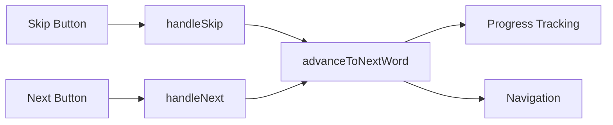

# Skip Button Feature - Project Summary

## Overview

This project transforms the rough idea of adding a skip button to the spelling test into a detailed, implementable design. The feature allows Leo to skip words he doesn't know, preventing him from getting stuck during practice while ensuring skipped words are properly tracked as failed attempts.

## Directory Structure

```
.sop/planning-skip-feature/
├── rough-idea.md (initial concept)
├── idea-honing.md (requirements clarification Q&A)
├── research/
│   └── next-button-implementation.md (analysis of existing Next button)
├── design/
│   └── detailed-design.md (comprehensive design document)
├── implementation/
│   └── plan.md (6-step implementation plan with checklist)
└── summary.md (this document)
```

## Key Design Elements

### User Experience
- **Skip button placement:** Below the Next button
- **Visual style:** Secondary/muted (gray background)
- **Behavior:** Disabled for first 3 seconds, then enabled
- **Smart handling:** Records typed text if present, or '[skipped]' marker if empty

### Technical Implementation
- **Minimal changes:** Only modifies SpellingTest.tsx and SpellingTest.css
- **Code reuse:** Extracts common navigation logic into `advanceToNextWord()` helper
- **Timer mechanism:** Uses React useEffect with setTimeout for 3-second delay
- **Progress tracking:** Leverages existing `recordAttempt` function from useWord hook

### Architecture


## Implementation Approach

The implementation is broken down into 6 incremental steps:

1. **Add timer logic** - Implement 3-second delay mechanism
2. **Refactor navigation** - Extract common logic into helper function
3. **Add skip handler** - Create handleSkip function
4. **Add button to UI** - Wire up JSX and event handlers
5. **Style the button** - Apply secondary/muted styling
6. **Test and refine** - Comprehensive testing across devices and modes

Each step builds on the previous one and results in working, testable functionality.

## Key Requirements

### Functional
- Skip button available on every word
- 3-second delay before enabling
- Records '[skipped]' for empty input, or actual text if typed
- Checks correctness of typed text (doesn't assume incorrect)
- Works in both practice and full_test modes
- Handles stage transitions correctly

### Non-Functional
- Consistent with existing Next button patterns
- Accessible on mobile/iPad devices
- No performance impact
- Maintainable code with good reuse

## Research Findings

From analyzing the existing Next button implementation:
- Uses `handleNext()` function for recording and navigation
- Progress tracked via `recordAttempt(wordId, correct, attempt)` from useWord hook
- Complex stage transition logic already implemented
- Consistent button styling with `.spelling-btn` class

**Key Insight:** Skip button can reuse almost all existing logic by extracting common navigation code.

## Next Steps

### To Begin Implementation

1. **Review the detailed design:** `.sop/planning-skip-feature/design/detailed-design.md`
2. **Follow the implementation plan:** `.sop/planning-skip-feature/implementation/plan.md`
3. **Use the checklist:** Track progress with the checklist at the top of plan.md

### Implementation Order

Start with Step 1 (timer logic) and proceed sequentially through Step 6 (testing). Each step is designed to be independently testable and builds incrementally toward the complete feature.

### Testing Strategy

- Unit test timer behavior and skip logic
- Integration test with full spelling test flow
- Manual test on desktop and iPad
- Verify results display handles '[skipped]' marker

## Design Decisions

### Why 3-second delay?
Encourages Leo to try before giving up, but not so long that it's frustrating.

### Why '[skipped]' marker?
Explicitly distinguishes skipped words from accidentally empty submissions in the data.

### Why check correctness of typed text?
Fair to Leo - if he typed the correct answer before clicking Skip, he should get credit.

### Why secondary/muted styling?
Makes Skip visually distinct from the primary Next action, indicating it's an alternative path.

### Why below Next button?
Maintains Next as the primary action (top position), with Skip as secondary option below.

## Files to Modify

- `src/pages/SpellingTest.tsx` - Add state, timer, handlers, and JSX
- `src/pages/SpellingTest.css` - Add `.spelling-skip-btn` styling

**No other files need modification** - feature is self-contained.

## Estimated Effort

- **Implementation:** 1-2 hours
- **Testing:** 30 minutes - 1 hour
- **Total:** 1.5-3 hours

## Success Criteria

✅ Skip button appears below Next button with muted styling  
✅ Button is disabled for 3 seconds after each word  
✅ Clicking with empty input records '[skipped]' as failed attempt  
✅ Clicking with text records that text and checks correctness  
✅ Navigation works correctly through all words and stages  
✅ Feature works on both desktop and iPad  
✅ No console errors or warnings  
✅ Progress tracking accurately reflects skipped attempts  

## Questions or Concerns?

Refer to:
- **Design details:** `design/detailed-design.md`
- **Implementation steps:** `implementation/plan.md`
- **Research findings:** `research/next-button-implementation.md`
- **Requirements:** `idea-honing.md`

All documentation is designed to be self-contained and comprehensive for implementation.
