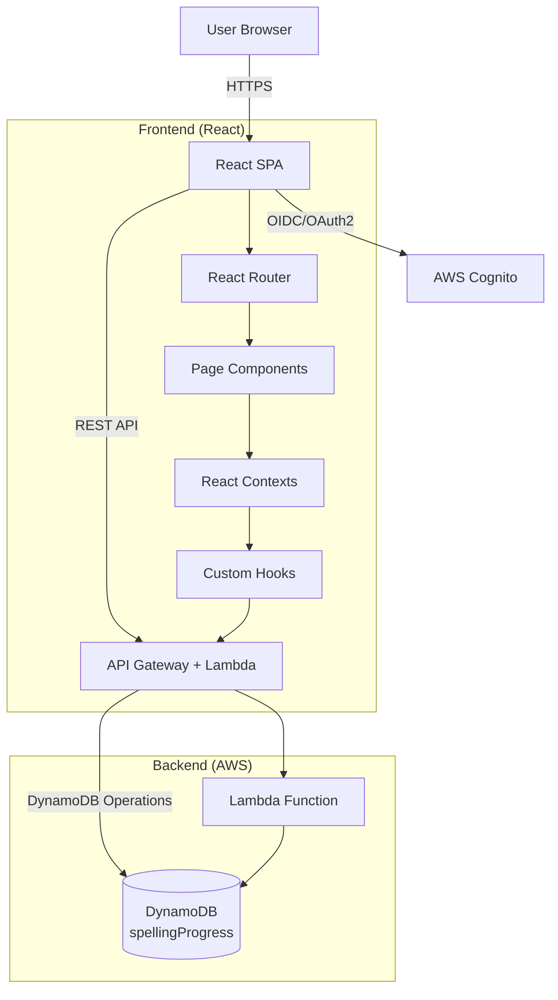
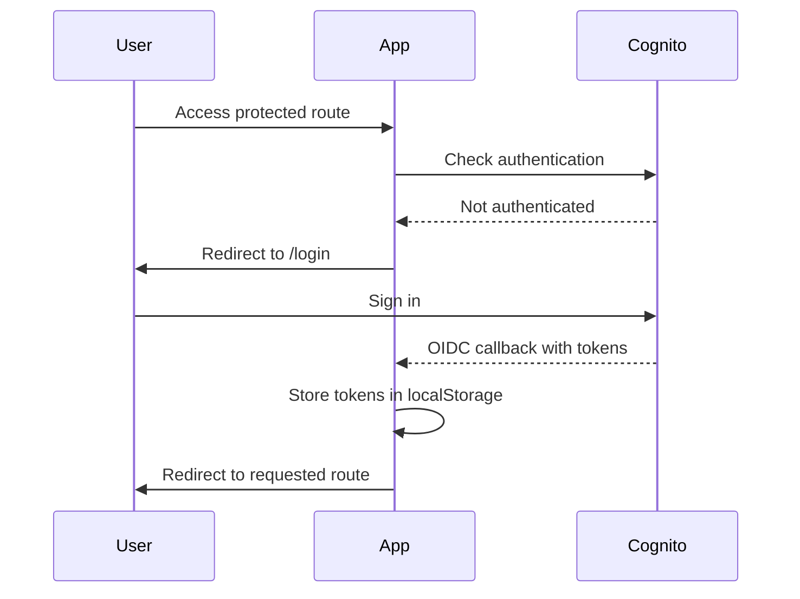
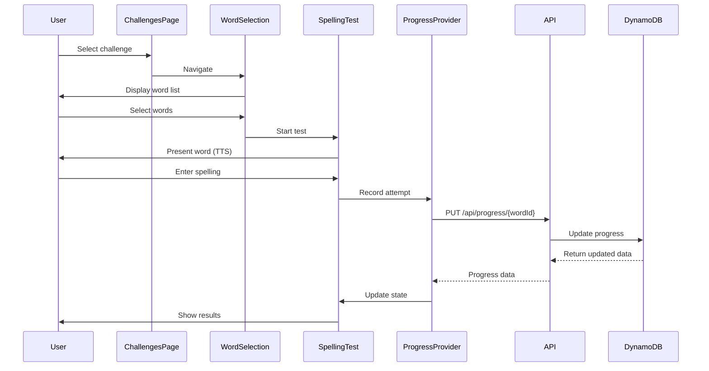
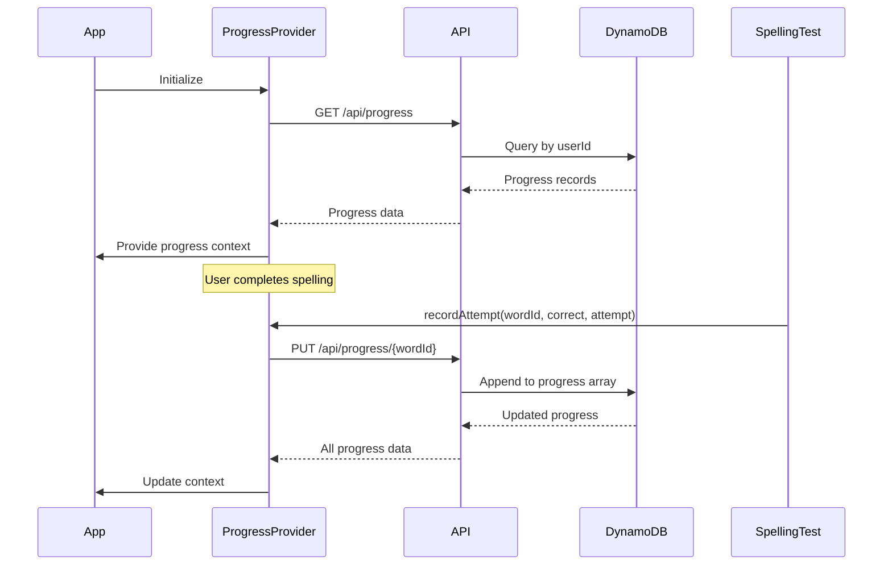
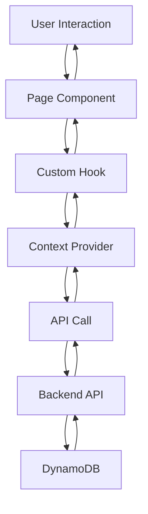
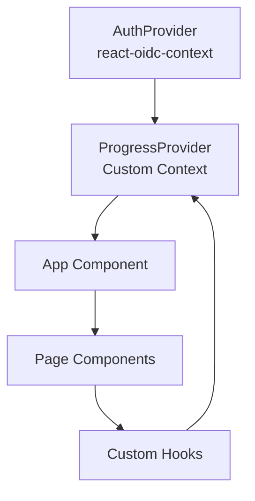

# System Architecture

## Overview

The Spelling Website is a client-side React application with a serverless backend. It follows a modern SPA (Single Page Application) architecture with authentication, state management through React Context, and RESTful API integration.

## Architecture Diagram

## Design Patterns

### 1. Component-Based Architecture
- **Pattern:** React functional components with hooks
- **Structure:** Pages → Components → Hooks → Utils
- **Benefits:** Reusability, testability, maintainability

### 2. Context API for State Management
- **Pattern:** React Context for global state
- **Implementations:**
  - `AuthProvider` (via react-oidc-context): Authentication state
  - `ProgressProvider`: User progress tracking
- **Benefits:** Avoids prop drilling, centralized state

### 3. Custom Hooks Pattern
- **Pattern:** Encapsulate business logic in reusable hooks
- **Examples:**
  - `useWord`: Word-specific progress and stats
  - `useProgressApi`: API communication abstraction
- **Benefits:** Logic reuse, separation of concerns

### 4. Protected Routes Pattern
- **Pattern:** Route-level authentication guards
- **Implementation:** `ProtectedRoute` component wraps protected pages
- **Flow:** Check auth → Redirect to login if not authenticated

### 5. Configuration-Driven Development
- **Pattern:** Centralized configuration objects
- **Example:** `wordSelectionConfigs.ts` defines word list configurations
- **Benefits:** Easy to add new word lists, maintainable

## Application Flow

### Authentication Flow

### Spelling Test Flow

### Progress Tracking Flow

## Data Flow Architecture

### State Management Layers

### Context Hierarchy

## Security Architecture

### Authentication
- **Method:** OIDC/OAuth2 with AWS Cognito
- **Token Storage:** localStorage via WebStorageStateStore
- **Token Renewal:** Automatic silent renewal
- **Session Monitoring:** Active session checking every 60 seconds

### Authorization
- **Route Protection:** Client-side route guards
- **API Authorization:** Bearer token in Authorization header
- **User Identification:** Cognito `sub` claim used as userId

### Data Security
- **HTTPS:** All communications encrypted
- **CORS:** Configured for API endpoints
- **Token Validation:** Server-side validation in Lambda authorizer

## Deployment Architecture

### Frontend
- **Build:** Vite production build
- **Output:** Static files in `dist/` directory
- **Hosting:** Static site hosting (e.g., S3 + CloudFront)

### Backend
- **API:** AWS API Gateway
- **Compute:** AWS Lambda (Node.js 22)
- **Database:** AWS DynamoDB
- **Authentication:** AWS Cognito User Pool

## Scalability Considerations

1. **Stateless Frontend:** Can be CDN-cached
2. **Serverless Backend:** Auto-scales with Lambda
3. **NoSQL Database:** DynamoDB scales horizontally
4. **Token-Based Auth:** Stateless authentication

## Technology Decisions

### Why React Context over Redux?
- Simpler state management needs
- Built-in React solution
- Less boilerplate
- Sufficient for current scale

### Why Vite over Create React App?
- Faster development builds
- Better HMR (Hot Module Replacement)
- Modern tooling
- Smaller bundle sizes

### Why DynamoDB?
- Serverless-friendly
- Auto-scaling
- Pay-per-use model
- Good for user-specific data (userId partition key)

### Why OIDC/OAuth2?
- Industry standard
- Secure token-based auth
- AWS Cognito integration
- Automatic token refresh

