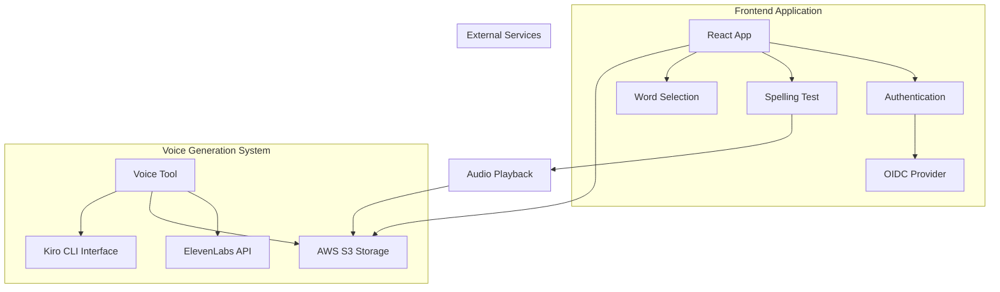
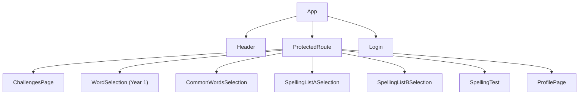
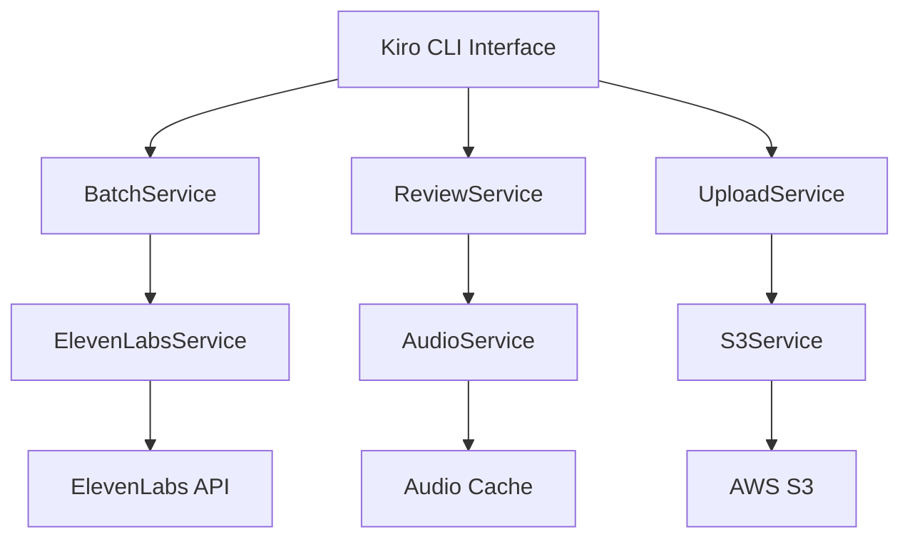
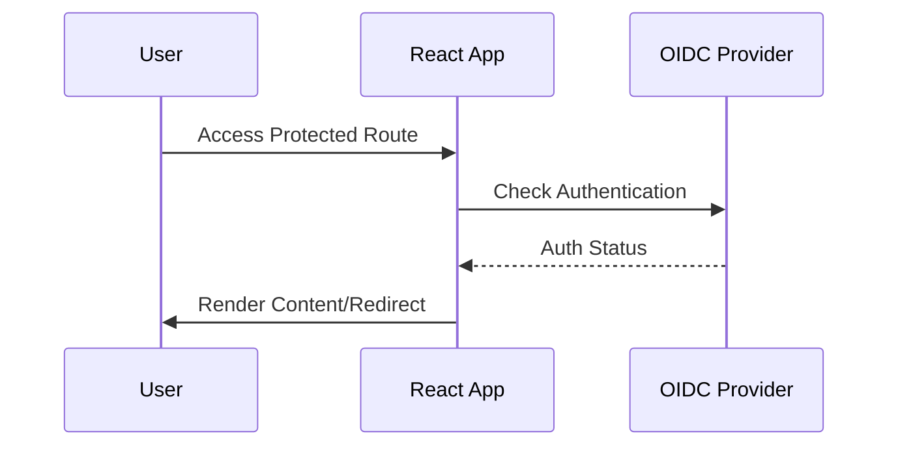
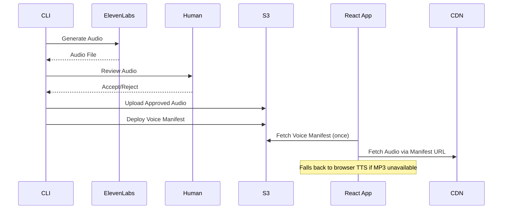

# System Architecture #architecture

## Overview
The Spelling Website is a dual-system architecture consisting of a React frontend application and a Node.js voice generation tool, designed for educational spelling practice with AI-generated voice prompts.

## Frontend Architecture #react

### Component Hierarchy

### State Management Pattern
- **Local State**: React useState for component-specific state
- **Authentication State**: OIDC Context for user authentication
- **Progress State**: ProgressProvider context for word-level progress tracking (API-backed)
- **Word Selection State**: Lifted state in App component
- **Test Progress**: Local state in SpellingTest component
- **Configuration State**: Centralized configs in `src/config/` (wordSelectionConfigs, masteryThresholds)

### Routing Architecture
- **Protected Routes**: All main functionality behind authentication
- **Route Guards**: ProtectedRoute component wraps authenticated pages
- **Navigation Flow**: Login → Challenges → Word Selection → Spelling Test
- **Routes**: `/` (Challenges), `/word-selection` (Year 1), `/common-words-selection`, `/spelling-list-a`, `/spelling-list-b`, `/spelling-test`

### Configuration-Driven Architecture (NEW)
- **Word Selection Configs**: Centralized `wordSelectionConfigs` object drives all 4 word selection pages
- **Mastery Thresholds**: Single source of truth via `getMasteryThreshold()` (MASTERY_THRESHOLD = 10 for all words)
- **Challenge Configs**: Per-challenge metadata (title, description, reward text, motivation messages)
- **Component Composition**: Thin wrapper pages (SpellingListASelection, SpellingListBSelection) delegate to BaseWordSelection

## Voice Tool Architecture #voice-tool

### Service Layer Pattern

### Processing Workflow
1. **Batch Generation**: Process word lists through ElevenLabs API
2. **Human Review**: Interactive CLI for voice quality control
3. **Voice Selection**: Multiple voice options with fallback chain
4. **S3 Deployment**: Automated upload with proper caching headers

## Integration Patterns

### Authentication Flow #api

### Voice Generation & Playback Flow #workflow

## Data Flow Architecture #data

### Frontend Data Flow
- **Props Down**: Data flows down through component hierarchy
- **Events Up**: User interactions bubble up through callbacks
- **Context**: Authentication state (OIDC) and Progress state (ProgressProvider) shared via React Context
- **Voice Manifest**: Lazy-loaded JSON manifest maps word IDs to CDN audio URLs
- **Configuration**: Centralized configs drive word selection pages and mastery thresholds

### Voice Tool Data Flow
- **File-based State**: JSON files for progress persistence
- **Streaming**: Audio files processed and cached locally
- **Batch Processing**: Word lists processed in configurable batches
- **Error Recovery**: Resume capability for interrupted sessions

## Deployment Architecture

### Frontend Deployment
- **Build Tool**: Vite for optimized production builds
- **Static Hosting**: Suitable for CDN deployment
- **Environment Config**: Build-time configuration injection

### Voice Tool Deployment
- **CLI Tool**: Standalone Node.js application
- **Local Execution**: Runs on developer machines
- **Cloud Integration**: Direct AWS S3 and ElevenLabs API access

## Security Architecture

### Frontend Security
- **OIDC Authentication**: Industry-standard authentication flow
- **Route Protection**: All sensitive routes behind authentication
- **HTTPS Only**: Secure communication with external services

### Voice Tool Security
- **API Key Management**: Environment variable configuration
- **AWS Credentials**: Standard AWS credential chain
- **Local File Security**: Temporary files with appropriate permissions

## Performance Considerations

### Frontend Performance
- **Code Splitting**: Vite handles automatic code splitting
- **Lazy Loading**: Route-based code splitting
- **Audio Caching**: Browser caching of audio files from S3

### Voice Tool Performance
- **Batch Processing**: Configurable batch sizes for API rate limits
- **Local Caching**: Audio files cached locally during generation
- **Resume Capability**: Avoid re-processing completed work

## Scalability Patterns

### Horizontal Scaling
- **Frontend**: Stateless React app scales via CDN
- **Voice Generation**: Parallel processing capability
- **Storage**: S3 provides unlimited scalable storage

### Vertical Scaling
- **API Rate Limits**: Configurable to match ElevenLabs quotas
- **Memory Management**: Streaming audio processing
- **Concurrent Processing**: Multiple voice generation streams
