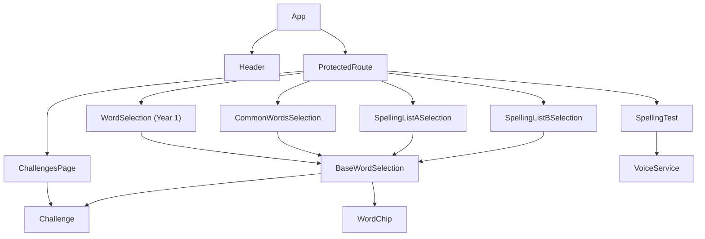
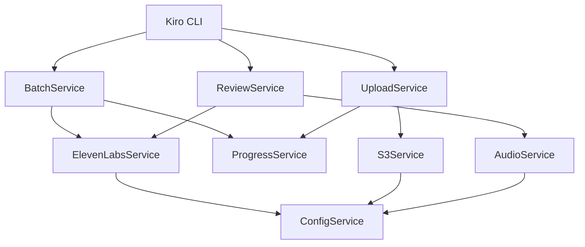

# Major Components #react #voice-tool

## Frontend Components #react

### Core Application Components

#### App.tsx
**Purpose**: Main application component and routing orchestrator
**Responsibilities**:
- Route configuration and navigation (6 protected routes)
- Authentication state management
- Word selection state lifting
- Protected route wrapping

**Key State**:
```typescript
selectedList: {
  words: string[];
  type: 'single' | 'less_family';
  testMode?: 'practice' | 'full_test';
  passThreshold?: number;
} | null
```

**Routes**:
- `/` → ChallengesPage
- `/word-selection` → Year 1 words
- `/common-words-selection` → Common words
- `/spelling-list-a` → Spelling List A
- `/spelling-list-b` → Spelling List B
- `/spelling-test` → Test page (requires selectedList, redirects if empty)

#### Header.tsx
**Purpose**: Application navigation and user interface
**Responsibilities**:
- Navigation menu
- User authentication status
- Logout functionality

#### ProtectedRoute.tsx
**Purpose**: Route guard for authenticated access
**Responsibilities**:
- Authentication verification
- Redirect to login for unauthenticated users
- Render protected content for authenticated users

### Page Components

#### ChallengesPage
**Purpose**: Main dashboard for all spelling challenges
**Responsibilities**:
- Display 4 challenge types: KS1-1, Common Words, List A, List B
- Calculate per-challenge progress using `useWord` hook
- Show progress bars with mastered/total counts
- Display status tiers: `completed`, `close`, `good`, `steady`, `starting`, `beginning`
- Show motivation messages based on progress thresholds
- Navigate to corresponding word selection pages

#### WordSelection, CommonWordsSelection, SpellingListASelection & SpellingListBSelection
**Purpose**: Word list selection interfaces (configuration-driven)
**Responsibilities**:
- Present word lists grouped by category
- Configure test parameters
- Pass selected words to spelling test
- SpellingListASelection and SpellingListBSelection are thin wrappers around `BaseWordSelection` using `wordSelectionConfigs`

#### SpellingTest
**Purpose**: Core spelling test functionality with VoiceService integration
**Responsibilities**:
- Audio playback via VoiceService (MP3 manifest lookup with TTS fallback)
- User input collection with auto-speak on step change
- Two-stage flow for `less_family` type (base words first, then full words)
- Progress tracking via `useWord` hooks and `recordAttempt`
- Results calculation and retry support
- Skip button with 3-second delay
- Mobile-friendly input focus scrolling

**Key Props**:
```typescript
{
  words: string[];
  listType: 'single' | 'less_family';
  testMode: 'practice' | 'full_test';
  passThreshold?: number;
  onComplete: () => void;
}
```

### Utility Components

#### BaseWordSelection.tsx
**Purpose**: Shared word selection logic with category grouping
**Responsibilities**:
- Calls `useWord` for all words upfront (consistent hook calls)
- Groups words by category, preserving order
- Shows overall and per-category progress bars with mastery status
- Clickable categories launch tests with `selectNextWords()` utility
- Supports optional `Challenge` component overlay
- Status icons with CSS classes (`not-started`, `in-progress`, `mastered`)
- Uses refs to memoize status map and avoid unnecessary re-renders

#### Challenge.tsx
**Purpose**: Gamification component with progress tracking and motivation messages
**Responsibilities**:
- Displays progress bar with mastered/total counts
- Motivation messages based on configurable thresholds
- Template variable replacement: `{remaining}`, `{total}`, `{mastered}`
- Clickable motivation messages launch practice with in-progress words
- "Take Full Challenge Test" button for full test mode
- Auto-detects `less_family` type if any words end with 'less'
- `DEFAULT_PASS_THRESHOLD = 85`

#### WordChip.tsx
**Purpose**: Individual word display component
**Responsibilities**:
- Word visualization
- Selection state indication
- Click handling for word selection

### Frontend Services

#### VoiceService (NEW)
**Purpose**: Audio playback with manifest-based MP3 lookup and TTS fallback
**Responsibilities**:
- Lazy-loads voice manifest from `/voices/voice-manifest.json` on first use
- Looks up word IDs in manifest to find CDN audio URLs
- Falls back to browser `speechSynthesis` TTS if MP3 not available
- Manages a single `HTMLAudioElement` instance
- Promise-based async API: `speak(word)`, `playMP3(url)`, `stop()`
- Stops both audio element and TTS on `stop()`

### Configuration Components (NEW)

#### masteryThresholds.ts
**Purpose**: Single source of truth for mastery threshold
**Exports**:
- `getMasteryThreshold(wordId: string): number` — Returns MASTERY_THRESHOLD (10) for all words
- `MASTERY_THRESHOLD = 10`

#### wordSelectionConfigs.ts
**Purpose**: Centralized configuration for all word selection pages
**Exports**:
- `WordSelectionConfig` interface
- `wordSelectionConfigs` record mapping config keys to configs
- Each config includes: words, title, theme, filters, challenge config, mastery threshold

## Voice Tool Components #voice-tool

### Service Layer

#### ElevenLabsService
**Purpose**: ElevenLabs API integration
**Responsibilities**:
- Voice generation requests
- API rate limit handling
- Error handling and retries
- Voice quality validation

#### AudioService
**Purpose**: Audio file management
**Responsibilities**:
- Local audio caching
- Playback functionality
- File format validation
- Audio quality assessment

#### S3Service
**Purpose**: AWS S3 integration
**Responsibilities**:
- Audio file uploads
- Bucket management
- Caching header configuration
- Upload progress tracking

#### ProgressService
**Purpose**: State persistence and resume capability
**Responsibilities**:
- JSON-based progress tracking
- Resume interrupted sessions
- Status reporting
- Error recovery

### CLI Interface Components

#### BatchService
**Purpose**: Batch audio generation orchestration
**Responsibilities**:
- Word list processing
- Parallel generation coordination
- Progress reporting
- Error aggregation

#### ReviewService
**Purpose**: Human-in-the-loop review workflow
**Responsibilities**:
- Audio playback for review
- Accept/reject decision handling
- Alternative voice generation
- Quality control workflow

#### UploadService
**Purpose**: S3 deployment coordination
**Responsibilities**:
- Batch upload orchestration
- Upload verification
- Metadata management
- Deployment reporting

### Operational Scripts (NEW)

#### generate-manifest.js
**Purpose**: Scans S3 bucket to build voice manifest JSON
**Responsibilities**:
- Lists all objects in S3 with `voices/` prefix
- Extracts word IDs from `.mp3` filenames
- Builds manifest mapping wordId → CDN URL (`https://spellingninjas.com/{key}`)
- Outputs JSON to stdout (designed for piping to file)

#### deploy-manifest.js
**Purpose**: Deploys voice manifest to S3 for public access
**Responsibilities**:
- Reads local manifest from `../public/voices/voice-manifest.json`
- Uploads to S3 at `voices/voice-manifest.json`
- Sets content type and cache headers (`max-age=3600`)
- Uses AWS SDK v3

#### check-missing-files.js
**Purpose**: Validates consistency between voice manifest and progress tracking
**Responsibilities**:
- Compares voice assignments between manifest and progress files
- Reports mismatches and missing entries
- Provides actionable recommendations

#### upload-approved-only.js
**Purpose**: Uploads only approved voice files to S3
**Responsibilities**:
- Filters progress file for `status === 'completed'` words
- Validates local file existence before upload
- Uploads via AWS CLI (`aws s3 cp`)
- Shows progress reporting and voice distribution analytics

### Configuration Components

#### ConfigService
**Purpose**: Environment and configuration management
**Responsibilities**:
- Environment variable loading
- Default value management
- Validation of required settings
- Configuration export for services

## Component Relationships

### Frontend Component Flow


### Voice Tool Service Dependencies


## Interface Contracts

### Frontend Component Props

#### SpellingTest Props
```typescript
interface SpellingTestProps {
  words: string[];
  listType: 'single' | 'less_family';
  testMode: 'practice' | 'full_test';
  passThreshold?: number;
  onComplete: () => void;
}
```

#### WordSelection Callback
```typescript
type OnSelectWords = (
  words: string[],
  type: 'single' | 'less_family',
  testMode?: 'practice' | 'full_test',
  passThreshold?: number
) => void;
```

### Voice Tool Service Interfaces

#### Voice Generation Request
```typescript
interface VoiceRequest {
  text: string;
  voice: string;
  wordId: string;
  outputPath: string;
}
```

#### Progress State
```typescript
interface ProgressState {
  completed: string[];
  failed: string[];
  pending: string[];
  currentVoice: string;
  lastUpdated: string;
}
```

## Testing Components

### Frontend Testing
- **WordChip.test.tsx**: Component behavior testing
- **React Testing Library**: Component rendering and interaction
- **Vitest**: Test runner and assertions

### Voice Tool Testing
- **Unit Tests**: Service layer testing
- **Integration Tests**: API integration validation
- **CLI Tests**: Command interface testing

## Error Handling Patterns

### Frontend Error Handling
- **Route Guards**: Authentication error handling
- **Component Boundaries**: Error boundary components
- **API Errors**: Graceful degradation for service failures

### Voice Tool Error Handling
- **Retry Logic**: Exponential backoff for API failures
- **Graceful Degradation**: Continue processing on partial failures
- **State Recovery**: Resume from last known good state
- **User Feedback**: Clear error messages and recovery options
