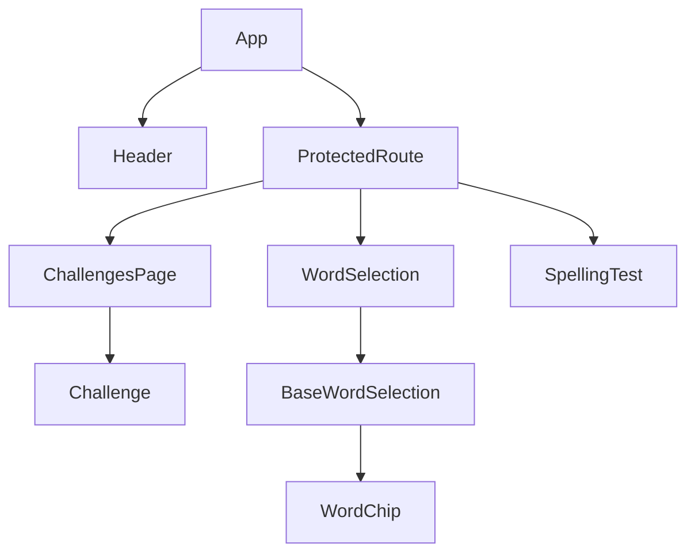
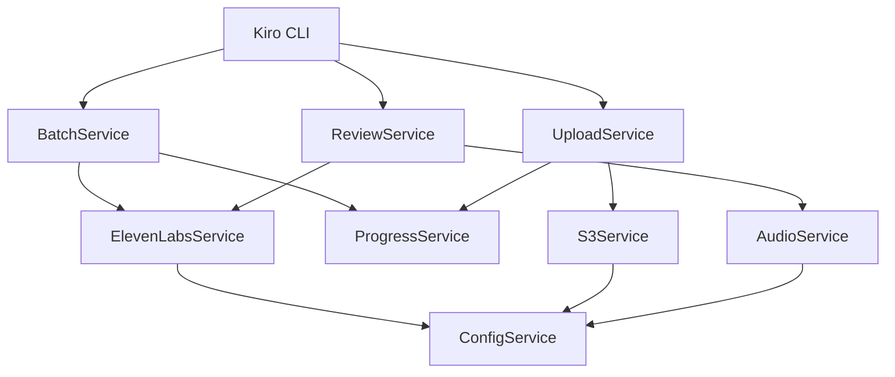

# Major Components #react #voice-tool

## Frontend Components #react

### Core Application Components

#### App.tsx
**Purpose**: Main application component and routing orchestrator
**Responsibilities**:
- Route configuration and navigation
- Authentication state management
- Word selection state lifting
- Protected route wrapping

**Key State**:
```typescript
selectedList: {
  words: string[];
  type: 'single' | 'less_family';
  testMode?: 'practice' | 'full_test';
  passThreshold?: number;
} | null
```

#### Header.tsx
**Purpose**: Application navigation and user interface
**Responsibilities**:
- Navigation menu
- User authentication status
- Logout functionality

#### ProtectedRoute.tsx
**Purpose**: Route guard for authenticated access
**Responsibilities**:
- Authentication verification
- Redirect to login for unauthenticated users
- Render protected content for authenticated users

### Page Components

#### ChallengesPage
**Purpose**: Main dashboard for spelling challenges
**Responsibilities**:
- Display available spelling challenges
- Navigate to word selection
- Show user progress

#### WordSelection & CommonWordsSelection
**Purpose**: Word list selection interface
**Responsibilities**:
- Present word lists for selection
- Configure test parameters
- Pass selected words to spelling test

#### SpellingTest
**Purpose**: Core spelling test functionality
**Responsibilities**:
- Audio playback for word pronunciation
- User input collection
- Progress tracking
- Results calculation

**Key Props**:
```typescript
{
  words: string[];
  listType: 'single' | 'less_family';
  testMode: 'practice' | 'full_test';
  passThreshold?: number;
  onComplete: () => void;
}
```

### Utility Components

#### BaseWordSelection.tsx
**Purpose**: Shared word selection logic
**Responsibilities**:
- Common word selection patterns
- Reusable selection interface
- State management for word lists

#### Challenge.tsx
**Purpose**: Individual challenge display component
**Responsibilities**:
- Challenge metadata display
- Progress visualization
- Challenge selection handling

#### WordChip.tsx
**Purpose**: Individual word display component
**Responsibilities**:
- Word visualization
- Selection state indication
- Click handling for word selection

## Voice Tool Components #voice-tool

### Service Layer

#### ElevenLabsService
**Purpose**: ElevenLabs API integration
**Responsibilities**:
- Voice generation requests
- API rate limit handling
- Error handling and retries
- Voice quality validation

#### AudioService
**Purpose**: Audio file management
**Responsibilities**:
- Local audio caching
- Playback functionality
- File format validation
- Audio quality assessment

#### S3Service
**Purpose**: AWS S3 integration
**Responsibilities**:
- Audio file uploads
- Bucket management
- Caching header configuration
- Upload progress tracking

#### ProgressService
**Purpose**: State persistence and resume capability
**Responsibilities**:
- JSON-based progress tracking
- Resume interrupted sessions
- Status reporting
- Error recovery

### CLI Interface Components

#### BatchService
**Purpose**: Batch audio generation orchestration
**Responsibilities**:
- Word list processing
- Parallel generation coordination
- Progress reporting
- Error aggregation

#### ReviewService
**Purpose**: Human-in-the-loop review workflow
**Responsibilities**:
- Audio playback for review
- Accept/reject decision handling
- Alternative voice generation
- Quality control workflow

#### UploadService
**Purpose**: S3 deployment coordination
**Responsibilities**:
- Batch upload orchestration
- Upload verification
- Metadata management
- Deployment reporting

### Configuration Components

#### ConfigService
**Purpose**: Environment and configuration management
**Responsibilities**:
- Environment variable loading
- Default value management
- Validation of required settings
- Configuration export for services

## Component Relationships

### Frontend Component Flow


### Voice Tool Service Dependencies


## Interface Contracts

### Frontend Component Props

#### SpellingTest Props
```typescript
interface SpellingTestProps {
  words: string[];
  listType: 'single' | 'less_family';
  testMode: 'practice' | 'full_test';
  passThreshold?: number;
  onComplete: () => void;
}
```

#### WordSelection Callback
```typescript
type OnSelectWords = (
  words: string[],
  type: 'single' | 'less_family',
  testMode?: 'practice' | 'full_test',
  passThreshold?: number
) => void;
```

### Voice Tool Service Interfaces

#### Voice Generation Request
```typescript
interface VoiceRequest {
  text: string;
  voice: string;
  wordId: string;
  outputPath: string;
}
```

#### Progress State
```typescript
interface ProgressState {
  completed: string[];
  failed: string[];
  pending: string[];
  currentVoice: string;
  lastUpdated: string;
}
```

## Testing Components

### Frontend Testing
- **WordChip.test.tsx**: Component behavior testing
- **React Testing Library**: Component rendering and interaction
- **Vitest**: Test runner and assertions

### Voice Tool Testing
- **Unit Tests**: Service layer testing
- **Integration Tests**: API integration validation
- **CLI Tests**: Command interface testing

## Error Handling Patterns

### Frontend Error Handling
- **Route Guards**: Authentication error handling
- **Component Boundaries**: Error boundary components
- **API Errors**: Graceful degradation for service failures

### Voice Tool Error Handling
- **Retry Logic**: Exponential backoff for API failures
- **Graceful Degradation**: Continue processing on partial failures
- **State Recovery**: Resume from last known good state
- **User Feedback**: Clear error messages and recovery options
