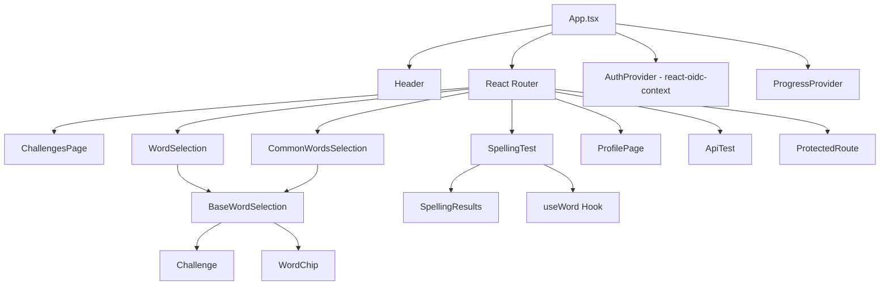
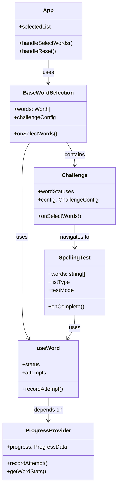

# Components Documentation

## Component Hierarchy

## Core Components

### App.tsx
**Purpose:** Main application component with routing and state management

**Responsibilities:**
- Define all application routes
- Manage selected word list state
- Provide authentication context
- Handle word selection callbacks

**Key Features:**
- Protected routes using `ProtectedRoute` wrapper
- State management for selected words and test configuration
- Navigation handling

**Props:** None (root component)

**State:**
- `selectedList`: Current word list selection with type, test mode, and pass threshold

**Routes:**
- `/` - ChallengesPage (protected)
- `/login` - Login page (unprotected)
- `/word-selection` - WordSelection page (protected)
- `/common-words-selection` - CommonWordsSelection page (protected)
- `/spelling-test` - SpellingTest page (protected)
- `/profile` - ProfilePage (protected)
- `/api-test` - ApiTest page (protected)

### Header.tsx
**Purpose:** Application header with branding and user info

**Responsibilities:**
- Display application name/logo
- Show authenticated user information
- Provide navigation to profile

**Features:**
- Clickable logo to navigate home
- User avatar (first letter of username)
- Username display
- Profile navigation

**Props:** None (uses hooks for auth)

**Dependencies:**
- `react-oidc-context` for authentication
- `react-router-dom` for navigation

## Page Components

### ChallengesPage.tsx
**Purpose:** Landing page displaying available spelling challenges

**Responsibilities:**
- Display challenge cards with progress
- Calculate progress for each challenge
- Navigate to word selection pages

**Features:**
- Multiple challenge types (KS1-1, Common Words)
- Progress visualization (percentage and word counts)
- Status-based messaging (completed, close, good, steady, starting, beginning)
- Clickable challenge cards

**State:** None (derived from word progress)

**Dependencies:**
- `useWord` hook for word status
- `YEAR1_WORDS`, `COMMON_WORDS` from data

### WordSelection.tsx / CommonWordsSelection.tsx
**Purpose:** Word selection pages for choosing words to practice

**Implementation:** Both use `BaseWordSelection` component with different configurations

**Features:**
- Category-based word organization
- Progress tracking per category
- Word status indicators
- Challenge integration

### SpellingTest.tsx
**Purpose:** Interactive spelling test interface

**Responsibilities:**
- Present words one at a time
- Text-to-speech integration
- Input handling and validation
- Progress recording
- Results display

**Key Features:**
- Two-stage testing for "less family" words (base word → full word)
- Practice mode and full test mode
- Pass threshold for full tests
- Automatic word pronunciation
- Keyboard navigation support

**Props:**
- `words`: Array of word strings
- `listType`: 'single' | 'less_family'
- `testMode`: 'practice' | 'full_test'
- `passThreshold`: Optional percentage threshold
- `onComplete`: Callback when test finishes

**State:**
- `step`: Current word index
- `answers`: Array of user answers
- `currentStage`: 'base' | 'full' (for less_family)
- `showResults`: Boolean for results display
- `done`: Test completion flag

**Dependencies:**
- `useWord` hook for each word
- `ProgressProvider` for recording attempts
- Browser SpeechSynthesis API

### SpellingResults.tsx
**Purpose:** Display spelling test results

**Responsibilities:**
- Show correct/incorrect answers
- Display word statistics
- Provide retry and practice options

**Props:**
- `words`: Array of tested words
- `answers`: User's answers
- `onPractice`: Callback for practice mode
- `onRetry`: Callback for retry
- `listType`: Word list type
- `isBaseStageResults`: Boolean for two-stage tests

### ProfilePage.tsx
**Purpose:** User profile and settings page

**Features:**
- User information display
- Progress statistics
- Logout functionality

### ApiTest.tsx
**Purpose:** API testing and debugging page

**Features:**
- Test API endpoints
- Display API responses
- Debug authentication

## Reusable Components

### BaseWordSelection.tsx
**Purpose:** Base component for word selection pages

**Responsibilities:**
- Display words organized by category
- Show progress per category
- Handle word selection
- Integrate challenge component

**Key Features:**
- Category grouping with progress bars
- Word status indicators (mastered, in-progress, not-started)
- Clickable categories to start tests
- Challenge integration
- Theme support

**Props:**
- `words`: Array of Word objects
- `title`: Page title
- `themeClass`: Optional CSS theme class
- `wordFilter`: Optional filter function
- `challengeConfig`: Optional challenge configuration
- `onSelectWords`: Callback for word selection

**State Management:**
- Uses `useWord` hook for all words (consistent hook calls)
- Memoized status maps for performance
- Category grouping with maintained order

### Challenge.tsx
**Purpose:** Gamified challenge display component

**Responsibilities:**
- Display challenge progress
- Show motivational messages
- Handle challenge actions (practice, full test)

**Features:**
- Progress visualization
- Dynamic motivation messages based on progress
- Template variable replacement ({total}, {mastered}, {remaining})
- Clickable motivation messages to start practice
- Full test button with pass threshold

**Props:**
- `wordStatuses`: Array of words with status
- `config`: ChallengeConfig object
- `onSelectWords`: Callback for word selection
- `navigate`: Navigation function

**Configuration:**
- Customizable thresholds (close, good, steady, starting)
- Customizable pass threshold (default 85%)
- Theme class support
- Motivation messages per status level

### WordChip.tsx
**Purpose:** Individual word display component with status

**Responsibilities:**
- Display word with visual status indicator
- Show status icon (✔︎, ✗, 🔄, ❔)

**Props:**
- `word`: Word object
- `onClick`: Optional click handler

**Status Types:**
- `mastered`: Green checkmark
- `unmastered`: Red X
- `in-progress`: Blue refresh icon
- `not-started`: Gray question mark

### ProtectedRoute.tsx
**Purpose:** Route guard for authentication

**Responsibilities:**
- Check authentication status
- Redirect to login if not authenticated
- Render children if authenticated

**Props:**
- `children`: React node to render if authenticated

**Flow:**
1. Check `auth.isAuthenticated`
2. If false → redirect to `/login`
3. If true → render children

## Component Relationships

## Styling Approach

- **Component-scoped CSS:** Each component/page has its own CSS file
- **CSS Modules:** Not used (standard CSS files)
- **Theme Classes:** Support for theme customization via `themeClass` prop
- **Responsive Design:** Mobile-first approach with touch-friendly interfaces

## Component Patterns

### 1. Hook-Based Data Fetching
Components use custom hooks (`useWord`, `useProgressApi`) to fetch and manage data, keeping components focused on presentation.

### 2. Configuration-Driven Components
Components like `BaseWordSelection` and `Challenge` accept configuration objects, making them reusable across different contexts.

### 3. Status-Based Rendering
Many components render differently based on word status (mastered, in-progress, not-started), providing visual feedback.

### 4. Memoization for Performance
Components use `useMemo` and `useRef` to optimize expensive computations and prevent unnecessary re-renders.

### 5. Callback Prop Pattern
Parent components pass callback functions to child components for handling user actions, maintaining unidirectional data flow.

