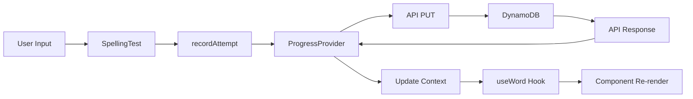
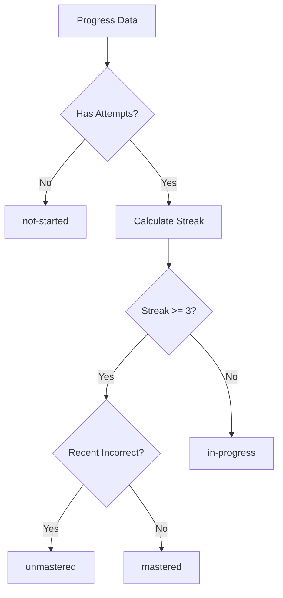
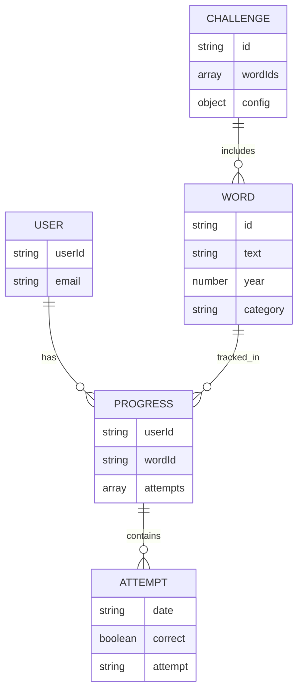

# Data Models

## Core Data Structures

### Word Model

**Location:** `src/data/words.ts`

```typescript
type Word = {
  id: string;          // Unique identifier, e.g., "off", "ff-off"
  text: string;        // Display text, e.g., "off"
  year: 1 | 2;         // Year level (1 or 2)
  category: string;    // Phonics category, e.g., "ff", "ll", "ai", "less"
}
```

**Examples:**
```typescript
{ id: 'off', text: 'off', year: 1, category: 'ff' }
{ id: 'helpless', text: 'helpless', year: 2, category: 'less' }
```

**Collections:**
- `YEAR1_WORDS`: Array of Year 1 words
- `COMMON_WORDS`: Array of common words
- `ALL_WORDS`: Combined array of all words

### Progress Data Model

**Location:** `src/contexts/ProgressProvider.tsx`

#### WordAttempt
```typescript
type WordAttempt = {
  date: string;        // ISO 8601 date string
  correct: boolean;    // Whether the attempt was correct
  attempt: string;     // The user's spelling attempt
}
```

#### ProgressData
```typescript
type ProgressData = Record<string, WordAttempt[]>;
// Maps wordId (string) to array of attempts
```

**Example:**
```typescript
{
  "off": [
    { date: "2024-01-15T10:30:00.000Z", correct: true, attempt: "off" },
    { date: "2024-01-16T14:20:00.000Z", correct: false, attempt: "of" }
  ],
  "well": [
    { date: "2024-01-17T09:15:00.000Z", correct: true, attempt: "well" }
  ]
}
```

#### WordStats
```typescript
type WordStats = {
  status: 'not-started' | 'in-progress' | 'mastered' | 'unmastered';
  attempts: number;      // Total number of attempts
  streak: number;       // Consecutive correct answers from most recent
  lastSeen: string | null; // ISO date of last attempt
}
```

**Status Calculation:**
- `not-started`: No attempts recorded
- `in-progress`: Has attempts but not mastered
- `mastered`: 3+ consecutive correct answers
- `unmastered`: Was previously mastered but got an incorrect answer

### User Model

**Source:** AWS Cognito user profile

```typescript
type User = {
  profile: {
    sub: string;                    // Cognito user ID
    email?: string;
    'cognito:username'?: string;
    phone?: string;
  };
  access_token: string;             // OAuth2 access token
  id_token: string;                 // OIDC ID token
  refresh_token?: string;            // OAuth2 refresh token
}
```

## Database Schema

### DynamoDB Table: `spellingProgress`

**Partition Key:** `userId` (String)  
**Sort Key:** `wordId` (String)

**Item Structure:**
```json
{
  "userId": "cognito-sub-id-12345",
  "wordId": "off",
  "progress": [
    {
      "date": "2024-01-15T10:30:00.000Z",
      "correct": true,
      "attempt": "off"
    },
    {
      "date": "2024-01-16T14:20:00.000Z",
      "correct": false,
      "attempt": "of"
    }
  ]
}
```

**Access Patterns:**
1. **Get all progress for user:** Query by `userId` (partition key)
2. **Update word progress:** Update item with `userId` + `wordId`, append to `progress` array

## Component State Models

### App Component State

```typescript
type SelectedList = {
  words: string[];                    // Array of word texts
  type: 'single' | 'less_family';     // Word list type
  testMode?: 'practice' | 'full_test'; // Test mode
  passThreshold?: number;              // Percentage threshold for full test
} | null;
```

### SpellingTest Component State

```typescript
type SpellingTestState = {
  step: number;                       // Current word index (0-based)
  answers: string[];                  // User's answers for all words
  currentStage: 'base' | 'full';      // For two-stage tests
  showResults: boolean;               // Whether to show results
  showPractice: boolean;              // Whether to show practice mode
  wordToUtter: string | null;         // Word to speak via TTS
  done: boolean;                      // Test completion flag
}
```

### Challenge Configuration Model

```typescript
interface ChallengeConfig {
  title: string;
  description: string;                 // Supports {total}, {mastered}, {remaining}
  rewardText?: string;
  themeClass?: string;
  motivationMessages: {
    complete?: string;                // 100% progress
    close?: string;                   // >= 80%
    good?: string;                    // >= 60%
    steady?: string;                  // >= 40%
    starting?: string;                // >= 20%
    beginning?: string;               // < 20%
  };
  thresholds?: {
    close?: number;                   // default 80
    good?: number;                    // default 60
    steady?: number;                  // default 40
    starting?: number;                 // default 20
  };
  passThreshold?: number;             // default 85
}
```

## Data Flow Models

### Progress Tracking Flow



### Word Status Calculation



## Data Transformations

### API Response → Frontend State

**API Response:**
```json
[
  { "userId": "user1", "wordId": "off", "progress": [...] },
  { "userId": "user1", "wordId": "well", "progress": [...] }
]
```

**Transformed to:**
```typescript
{
  "off": [...],
  "well": [...]
}
```

**Transformation Code:**
```typescript
const progressByWord: ProgressData = {};
remote.forEach(item => {
  progressByWord[item.wordId] = item.progress;
});
```

### Word Selection → Test Configuration

**Input:** User selects words from UI

**Output:**
```typescript
{
  words: ["off", "well", "hill"],
  type: "single",
  testMode: "practice",
  passThreshold: undefined
}
```

## Data Validation

### Word Attempt Validation
- `date`: Must be valid ISO 8601 string
- `correct`: Must be boolean
- `attempt`: Must be non-empty string

### Progress Data Validation
- `progress`: Must be array
- Each item must match `WordAttempt` structure
- Array is append-only (no deletions)

### Word ID Validation
- Must exist in `ALL_WORDS` array
- Falls back to wordId as text if not found

## Data Persistence

### Frontend Storage
- **Tokens:** localStorage via `WebStorageStateStore`
- **Progress:** Fetched from API, stored in React Context (in-memory)
- **No local persistence:** Progress always synced with backend

### Backend Storage
- **DynamoDB:** Persistent storage
- **Partition Key:** userId (enables efficient user-specific queries)
- **Sort Key:** wordId (enables per-word updates)

## Data Consistency

### Progress Updates
- **Atomic Operations:** DynamoDB `list_append` ensures atomic updates
- **Complete Data Return:** PUT operations return all progress data
- **Optimistic Updates:** Frontend updates immediately, syncs with backend

### Mastery Status
- **Calculated Client-Side:** Based on attempt history
- **Streak-Based:** 3 consecutive correct = mastered
- **State Tracking:** Tracks "unmastered" state for previously mastered words

## Data Relationships



