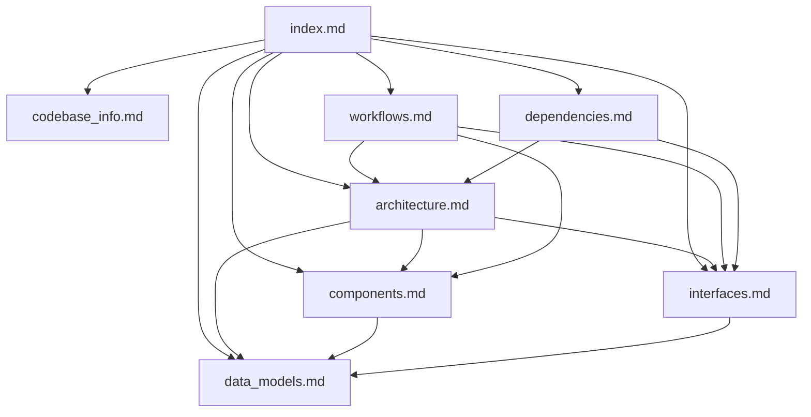

# Documentation Index - Knowledge Base for AI Assistants

## Purpose

This index serves as the primary entry point for AI coding assistants working with this codebase. It provides structured metadata about all documentation files, their purposes, and how to use them effectively.

## How to Use This Documentation

1. **Start here** when you need to understand the codebase structure
2. **Consult specific files** based on the question type (see table below)
3. **Use the metadata** to determine which files contain relevant information
4. **Follow cross-references** between related documents

## Documentation Files Overview

| File | Purpose | When to Use | Key Topics |
|------|---------|-------------|------------|
| **codebase_info.md** | Basic project information and structure | Getting started, understanding tech stack | Project overview, tech stack, file structure, build commands |
| **architecture.md** | System design and architectural patterns | Understanding how the system works, design decisions | Architecture diagrams, design patterns, data flow, security |
| **components.md** | React component documentation | Working with UI components, understanding component hierarchy | Component props, responsibilities, relationships, patterns |
| **interfaces.md** | API and data interface specifications | Integrating with APIs, understanding data structures | API endpoints, request/response formats, authentication |
| **data_models.md** | Data structure definitions and schemas | Working with data, understanding data flow | Type definitions, database schema, data transformations |
| **workflows.md** | User and system process flows | Understanding user journeys, system processes | Sequence diagrams, flowcharts, process descriptions |
| **dependencies.md** | External dependencies and services | Understanding external integrations, dependency management | npm packages, AWS services, browser APIs |

## Quick Reference by Question Type

### "How does X work?"
- **Architecture questions:** → `architecture.md`
- **Component behavior:** → `components.md`
- **Data flow:** → `workflows.md`
- **API interactions:** → `interfaces.md`

### "What is the structure of Y?"
- **Project structure:** → `codebase_info.md`
- **Component hierarchy:** → `components.md`
- **Data models:** → `data_models.md`
- **File organization:** → `codebase_info.md`

### "How do I integrate with Z?"
- **API integration:** → `interfaces.md`
- **Authentication:** → `interfaces.md`, `architecture.md`
- **External services:** → `dependencies.md`
- **Database:** → `data_models.md`, `interfaces.md`

### "What are the dependencies?"
- **npm packages:** → `dependencies.md`
- **AWS services:** → `dependencies.md`
- **Browser APIs:** → `dependencies.md`

### "How does the user flow work?"
- **User workflows:** → `workflows.md`
- **Component interactions:** → `components.md`
- **State management:** → `architecture.md`, `data_models.md`

## File Relationships

## Key Concepts Cross-Reference

### Authentication
- **Overview:** `architecture.md` (Authentication Flow section)
- **Implementation:** `interfaces.md` (Authentication Interface section)
- **Workflow:** `workflows.md` (Authentication Workflow)
- **Components:** `components.md` (ProtectedRoute, Header)

### Progress Tracking
- **Data Model:** `data_models.md` (Progress Data Model)
- **API:** `interfaces.md` (PUT /api/progress/{wordId})
- **Workflow:** `workflows.md` (Progress Tracking Workflow)
- **Components:** `components.md` (ProgressProvider, useWord)

### Word Management
- **Data Model:** `data_models.md` (Word Model)
- **Components:** `components.md` (BaseWordSelection, WordChip)
- **Workflow:** `workflows.md` (Word Selection Workflow)
- **Configuration:** `codebase_info.md` (Project Structure)

### Spelling Tests
- **Component:** `components.md` (SpellingTest)
- **Workflow:** `workflows.md` (Spelling Practice Workflow)
- **Data Flow:** `architecture.md` (Application Flow)
- **State Management:** `data_models.md` (Component State Models)

## Documentation Metadata

### codebase_info.md
- **Lines of Code:** ~150
- **Last Updated:** Generated during codebase summary
- **Coverage:** Project overview, tech stack, structure
- **Completeness:** High - covers all major aspects
- **Language Support:** TypeScript/JavaScript, CSS, HTML

### architecture.md
- **Lines of Code:** ~400
- **Diagrams:** 6 Mermaid diagrams
- **Coverage:** System architecture, patterns, security
- **Completeness:** High - comprehensive architecture documentation
- **Visual Aids:** Architecture, sequence, and flow diagrams

### components.md
- **Lines of Code:** ~500
- **Components Documented:** 12+ components
- **Coverage:** All major React components
- **Completeness:** High - all components documented
- **Patterns:** Hook-based, configuration-driven, status-based

### interfaces.md
- **Lines of Code:** ~350
- **APIs Documented:** 2 REST endpoints
- **Coverage:** Frontend interfaces, backend APIs, authentication
- **Completeness:** High - all interfaces documented
- **Examples:** Request/response examples included

### data_models.md
- **Lines of Code:** ~400
- **Models Documented:** 8+ data types
- **Coverage:** All data structures and transformations
- **Completeness:** High - comprehensive data documentation
- **Diagrams:** ER diagram for relationships

### workflows.md
- **Lines of Code:** ~450
- **Workflows Documented:** 8+ workflows
- **Coverage:** User flows, system processes, error handling
- **Completeness:** High - all major workflows documented
- **Diagrams:** Sequence and flowchart diagrams

### dependencies.md
- **Lines of Code:** ~350
- **Dependencies Documented:** 20+ packages, 4 AWS services
- **Coverage:** All production and dev dependencies
- **Completeness:** High - comprehensive dependency documentation
- **Security:** Security considerations included

## Usage Examples for AI Assistants

### Example 1: "How do I add a new word list?"
1. Check `codebase_info.md` for project structure
2. Review `data_models.md` for Word type definition
3. Look at `components.md` for BaseWordSelection usage
4. Check `config/wordSelectionConfigs.ts` in codebase

### Example 2: "How does progress tracking work?"
1. Start with `workflows.md` (Progress Tracking Workflow)
2. Review `data_models.md` (Progress Data Model)
3. Check `interfaces.md` (PUT /api/progress/{wordId})
4. Look at `components.md` (ProgressProvider, useWord)

### Example 3: "How do I modify the authentication flow?"
1. Review `architecture.md` (Authentication Flow)
2. Check `interfaces.md` (Authentication Interface)
3. Look at `workflows.md` (Authentication Workflow)
4. Review `components.md` (ProtectedRoute)

### Example 4: "What dependencies are used for testing?"
1. Check `dependencies.md` (Testing section)
2. Review `codebase_info.md` for test setup
3. Look at test files in `src/test/` directory

## Maintenance Guidelines

### When to Update Documentation
- **New features added:** Update relevant workflow and component docs
- **API changes:** Update interfaces.md and workflows.md
- **New dependencies:** Update dependencies.md
- **Architecture changes:** Update architecture.md
- **New data models:** Update data_models.md

### Documentation Standards
- Use Mermaid diagrams for visual representations
- Include code examples where helpful
- Maintain cross-references between documents
- Keep metadata in this index up to date

## Gaps and Limitations

### Known Gaps
- **Testing documentation:** Test files exist but testing strategy not fully documented
- **Deployment process:** Deployment steps not documented
- **Environment variables:** Configuration not fully documented
- **Error handling details:** Some error scenarios not fully covered

### Language Support
- **Primary Language:** TypeScript/JavaScript (100% coverage)
- **Styling:** CSS (documented in component files)
- **Backend:** Node.js (documented in lambdas/)

### Areas Needing More Detail
- **Performance optimization:** Not extensively documented
- **Accessibility:** Not documented
- **Browser compatibility:** Not fully documented
- **Mobile responsiveness:** Not extensively documented

## Next Steps for AI Assistants

1. **Read this index** to understand documentation structure
2. **Identify relevant files** based on your question
3. **Read specific documentation** files
4. **Consult codebase** for implementation details
5. **Ask clarifying questions** if information is missing

## Summary

This documentation provides comprehensive coverage of the Spelling Website codebase. The index.md file serves as the central hub, with specialized documentation files covering architecture, components, interfaces, data models, workflows, and dependencies. Use this index to quickly locate relevant information and understand how different aspects of the system relate to each other.

