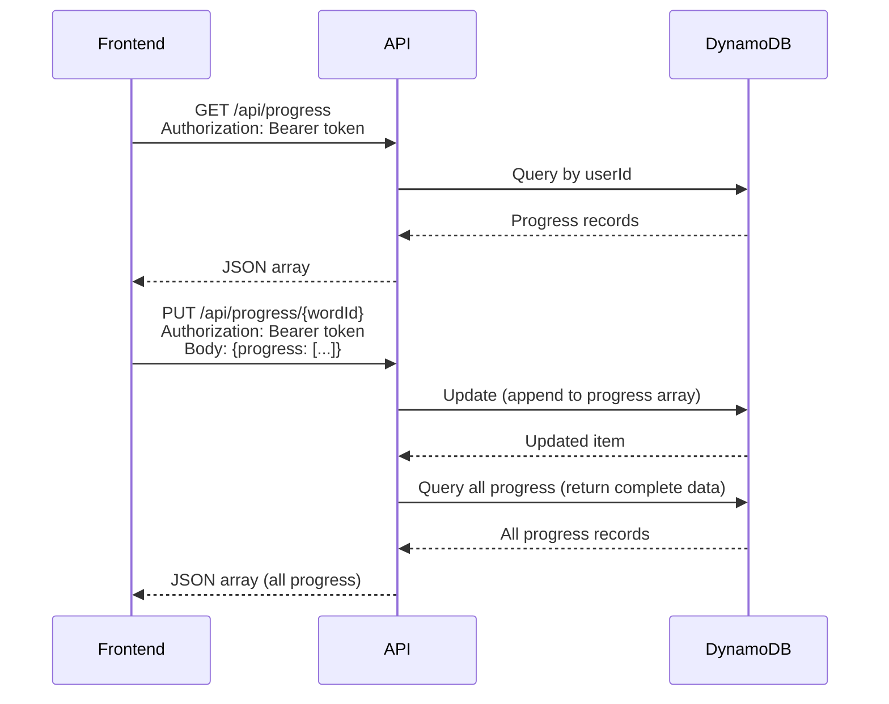
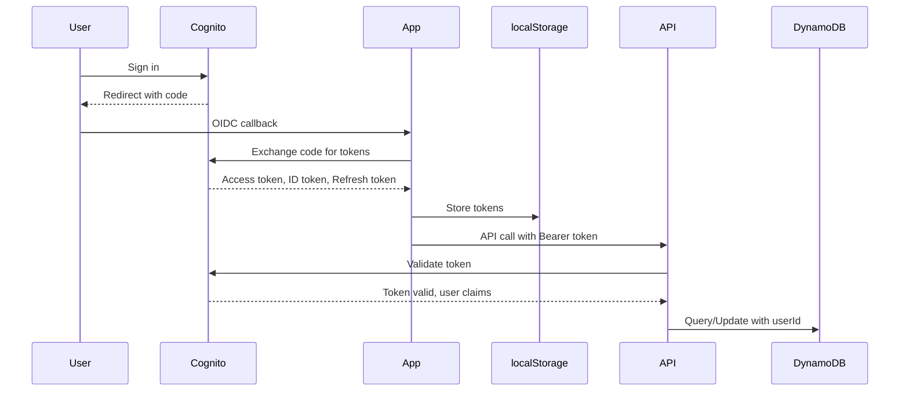

# Interfaces and APIs

## Frontend Interfaces

### React Component Interfaces

#### Word Type
```typescript
type Word = {
  id: string;          // Unique identifier (e.g., "ff-off")
  text: string;        // Plain word text
  year: 1 | 2;         // Year level
  category: string;    // Phonics grouping ("ff", "ll", "ss", etc.)
}
```

#### Progress Data Types
```typescript
type WordAttempt = {
  date: string;        // ISO date string
  correct: boolean;    // Whether attempt was correct
  attempt: string;     // User's spelling attempt
}

type ProgressData = Record<string, WordAttempt[]>;
// Maps wordId to array of attempts

type WordStats = {
  status: 'not-started' | 'in-progress' | 'mastered' | 'unmastered';
  attempts: number;
  streak: number;      // Consecutive correct answers
  lastSeen: string | null;
}
```

#### Challenge Configuration
```typescript
interface ChallengeConfig {
  title: string;
  description: string;
  rewardText?: string;
  themeClass?: string;
  motivationMessages: {
    complete?: string;
    close?: string;    // >= 80%
    good?: string;     // >= 60%
    steady?: string;   // >= 40%
    starting?: string; // >= 20%
    beginning?: string; // < 20%
  };
  thresholds?: {
    close?: number;    // default 80
    good?: number;     // default 60
    steady?: number;   // default 40
    starting?: number; // default 20
  };
  passThreshold?: number; // default 85
}
```

## Backend API Interfaces

### REST API Endpoints

**Base URL:** `https://api.spellingninjas.com/api/progress`

#### GET /api/progress
**Purpose:** Retrieve all progress data for authenticated user

**Authentication:** Bearer token in Authorization header

**Request:**
```http
GET /api/progress
Authorization: Bearer <access_token>
```

**Response:**
```json
[
  {
    "userId": "cognito-sub-id",
    "wordId": "off",
    "progress": [
      {
        "date": "2024-01-15T10:30:00.000Z",
        "correct": true,
        "attempt": "off"
      },
      {
        "date": "2024-01-16T14:20:00.000Z",
        "correct": false,
        "attempt": "of"
      }
    ]
  },
  // ... more word progress records
]
```

**Status Codes:**
- `200`: Success
- `401`: Unauthorized (missing or invalid token)
- `500`: Server error

#### PUT /api/progress/{wordId}
**Purpose:** Record a new attempt for a word

**Authentication:** Bearer token in Authorization header

**Request:**
```http
PUT /api/progress/{wordId}
Authorization: Bearer <access_token>
Content-Type: application/json

{
  "progress": [
    {
      "date": "2024-01-17T09:15:00.000Z",
      "correct": true,
      "attempt": "off"
    }
  ]
}
```

**Response:** Same as GET /api/progress (returns all progress data)

**Status Codes:**
- `200`: Success
- `400`: Bad request (missing body or progress property)
- `401`: Unauthorized
- `500`: Server error

**Note:** The API appends new attempts to the existing progress array using DynamoDB's `list_append` operation.

## AWS Lambda Interface

### Lambda Handler
**File:** `lambdas/progress.js`

**Event Structure:**
```javascript
{
  requestContext: {
    http: {
      method: 'GET' | 'PUT' | 'OPTIONS'
    },
    authorizer: {
      jwt: {
        claims: {
          sub: 'cognito-user-id'
        }
      }
    }
  },
  routeKey: 'GET /api/progress' | 'PUT /api/progress/{wordId}',
  pathParameters: {
    wordId: 'word-id' // Only for PUT requests
  },
  body: '{"progress": [...]}' // Only for PUT requests
}
```

**Response Structure:**
```javascript
{
  statusCode: 200 | 400 | 401 | 404 | 500,
  headers: {
    'Access-Control-Allow-Origin': '*',
    'Access-Control-Allow-Headers': 'Content-Type,Authorization',
    'Access-Control-Allow-Methods': 'GET,PUT,OPTIONS'
  },
  body: JSON.stringify(data)
}
```

## DynamoDB Schema

### Table: `spellingProgress`

**Partition Key:** `userId` (String)  
**Sort Key:** `wordId` (String)

**Item Structure:**
```json
{
  "userId": "cognito-sub-id",
  "wordId": "off",
  "progress": [
    {
      "date": "2024-01-15T10:30:00.000Z",
      "correct": true,
      "attempt": "off"
    }
  ]
}
```

**Operations:**
- **Query:** Get all items for a userId (partition key query)
- **Update:** Append to progress array using `list_append`

## Authentication Interface

### OIDC Configuration
**Provider:** AWS Cognito  
**Region:** eu-west-2  
**User Pool ID:** eu-west-2_XeQbQOSjJ  
**Client ID:** 3ua09or8n2k4cqldeu3u8bv585

**Configuration:**
```typescript
{
  authority: "https://cognito-idp.eu-west-2.amazonaws.com/eu-west-2_XeQbQOSjJ",
  client_id: "3ua09or8n2k4cqldeu3u8bv585",
  redirect_uri: window.location.origin + "/",
  silent_redirect_uri: window.location.origin + "/silent-renew.html",
  response_type: "code",
  scope: "openid email phone",
  automaticSilentRenew: true,
  monitorSession: true,
  checkSessionInterval: 60,
  accessTokenExpiringNotificationTime: 60
}
```

**Token Storage:**
- Uses `WebStorageStateStore` with localStorage
- Stores access_token, id_token, refresh_token

**Token Usage:**
- Access token sent in `Authorization: Bearer <token>` header
- User ID extracted from token's `sub` claim

## Integration Points

### Frontend ↔ Backend



### Authentication Flow



## Error Handling

### API Error Responses
```json
{
  "error": "Error message description"
}
```

### Common Error Scenarios
1. **401 Unauthorized:** Missing or invalid token
2. **400 Bad Request:** Missing request body or invalid JSON
3. **404 Not Found:** Invalid route
4. **500 Server Error:** DynamoDB error or other server issue

### Frontend Error Handling
- API errors logged to console
- User sees loading states during API calls
- Failed attempts don't block UI (graceful degradation)

## CORS Configuration

**Allowed Origins:** `*` (all origins)  
**Allowed Methods:** `GET, PUT, OPTIONS`  
**Allowed Headers:** `Content-Type, Authorization`

## Rate Limiting

Not currently implemented. Consider adding for production use.

