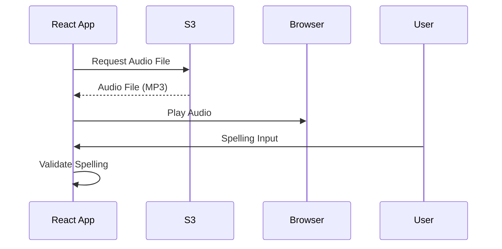
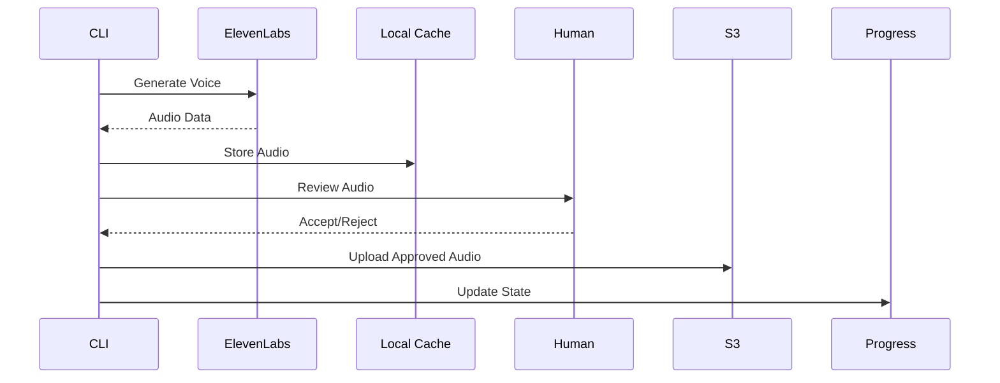
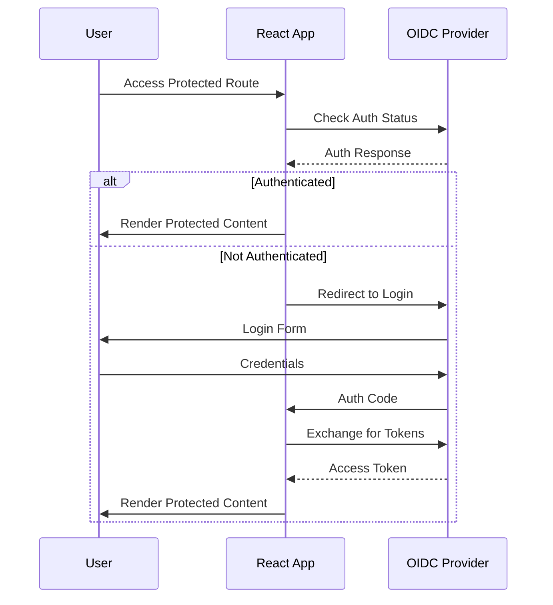

# APIs and Interfaces #api

## External API Integrations

### ElevenLabs API #voice-tool
**Purpose**: AI voice generation for spelling word pronunciation
**Base URL**: `https://api.elevenlabs.io/v1/`
**Authentication**: API Key in headers

#### Voice Generation Endpoint
```typescript
POST /text-to-speech/{voice_id}
Headers: {
  'xi-api-key': string,
  'Content-Type': 'application/json'
}
Body: {
  text: string,
  model_id?: string,
  voice_settings?: {
    stability: number,
    similarity_boost: number
  }
}
Response: Audio file (MP3)
```

#### Available Voices
- **Rachel**: Primary voice (female, clear pronunciation)
- **Dorothy**: Alternative female voice
- **Emily**: Secondary female voice
- **Thomas**: Primary male voice
- **Antoni**: Alternative male voice
- **Adam**: Secondary male voice

### AWS S3 API #voice-tool
**Purpose**: Audio file storage and CDN delivery
**Service**: AWS S3 with public read access
**Bucket**: `spellmatereact`
**Region**: `eu-west-2`

#### Upload Configuration
```typescript
{
  Bucket: 'spellmatereact',
  Key: `voices/${voice_name}/${word_id}.mp3`,
  Body: audioBuffer,
  ContentType: 'audio/mpeg',
  CacheControl: 'public, max-age=31536000'
}
```

#### Access Pattern
```
https://spellmatereact.s3.eu-west-2.amazonaws.com/voices/{voice_name}/{word_id}.mp3
```

### OIDC Authentication API #react
**Purpose**: User authentication and authorization
**Provider**: Configurable OIDC provider
**Flow**: Authorization Code Flow with PKCE

#### Configuration
```typescript
{
  authority: string,
  client_id: string,
  redirect_uri: string,
  response_type: 'code',
  scope: 'openid profile email',
  automaticSilentRenew: true
}
```

## Internal Interfaces

### React Component Interfaces #react

#### Word Selection Interface
```typescript
interface WordSelectionProps {
  onSelectWords: (
    words: string[],
    type: 'single' | 'less_family',
    testMode?: 'practice' | 'full_test',
    passThreshold?: number
  ) => void;
}
```

#### Spelling Test Interface
```typescript
interface SpellingTestProps {
  words: string[];
  listType: 'single' | 'less_family';
  testMode: 'practice' | 'full_test';
  passThreshold?: number;
  onComplete: () => void;
}
```

#### Authentication Context
```typescript
interface AuthContextType {
  user?: User;
  isAuthenticated: boolean;
  isLoading: boolean;
  signinRedirect: () => Promise<void>;
  signoutRedirect: () => Promise<void>;
}
```

### Voice Tool Service Interfaces #voice-tool

#### Voice Generation Service
```typescript
interface VoiceGenerationService {
  generateVoice(request: VoiceRequest): Promise<VoiceResponse>;
  getAvailableVoices(): Promise<Voice[]>;
  validateApiKey(): Promise<boolean>;
}

interface VoiceRequest {
  text: string;
  voiceId: string;
  outputPath: string;
  settings?: VoiceSettings;
}

interface VoiceResponse {
  success: boolean;
  audioPath?: string;
  error?: string;
  duration?: number;
}
```

#### Progress Management Service
```typescript
interface ProgressService {
  saveProgress(state: ProgressState): Promise<void>;
  loadProgress(): Promise<ProgressState>;
  markCompleted(wordId: string): Promise<void>;
  markFailed(wordId: string, error: string): Promise<void>;
}

interface ProgressState {
  completed: string[];
  failed: string[];
  pending: string[];
  currentVoice: string;
  lastUpdated: string;
  errors: Record<string, string>;
}
```

#### S3 Upload Service
```typescript
interface S3Service {
  uploadFile(params: UploadParams): Promise<UploadResult>;
  verifyUpload(key: string): Promise<boolean>;
  listFiles(prefix: string): Promise<S3Object[]>;
}

interface UploadParams {
  filePath: string;
  key: string;
  contentType: string;
  cacheControl?: string;
}
```

## Data Contracts

### Word List Structure #data
```typescript
interface WordList {
  id: string;
  name: string;
  words: string[];
  type: 'single' | 'less_family';
  difficulty?: number;
  category?: string;
}
```

### Audio File Metadata
```typescript
interface AudioMetadata {
  wordId: string;
  voice: string;
  duration: number;
  fileSize: number;
  generatedAt: string;
  s3Key: string;
  s3Url: string;
}
```

### Test Results Structure
```typescript
interface TestResult {
  wordId: string;
  userInput: string;
  correct: boolean;
  attempts: number;
  timeSpent: number;
  audioPlayed: number;
}

interface TestSession {
  sessionId: string;
  userId: string;
  listType: 'single' | 'less_family';
  testMode: 'practice' | 'full_test';
  results: TestResult[];
  score: number;
  passed: boolean;
  completedAt: string;
}
```

## Integration Patterns

### Frontend-to-S3 Integration #workflow


### Voice Tool Workflow #workflow


### Authentication Flow #workflow


## Error Handling Interfaces

### API Error Response
```typescript
interface ApiError {
  code: string;
  message: string;
  details?: Record<string, any>;
  timestamp: string;
}
```

### Voice Generation Errors
```typescript
enum VoiceGenerationError {
  API_KEY_INVALID = 'api_key_invalid',
  QUOTA_EXCEEDED = 'quota_exceeded',
  VOICE_NOT_FOUND = 'voice_not_found',
  TEXT_TOO_LONG = 'text_too_long',
  NETWORK_ERROR = 'network_error'
}
```

### S3 Upload Errors
```typescript
enum S3UploadError {
  ACCESS_DENIED = 'access_denied',
  BUCKET_NOT_FOUND = 'bucket_not_found',
  FILE_TOO_LARGE = 'file_too_large',
  NETWORK_ERROR = 'network_error'
}
```

## Rate Limiting and Quotas

### ElevenLabs API Limits
- **Free Tier**: 10,000 characters/month
- **Starter**: 30,000 characters/month
- **Creator**: 100,000 characters/month
- **Rate Limit**: Configurable requests per minute

### S3 Upload Limits
- **File Size**: 5GB maximum per file
- **Request Rate**: No specific limits for standard uploads
- **Bandwidth**: Scales automatically

## Security Considerations

### API Key Management
- Environment variable storage
- No hardcoded keys in source code
- Rotation capability

### CORS Configuration
- Restricted origins for production
- Appropriate headers for development
- Secure cookie settings

### S3 Security
- Public read access for audio files
- Restricted write access via IAM
- Proper bucket policies
