# Workflows

## User Workflows

### Authentication Workflow

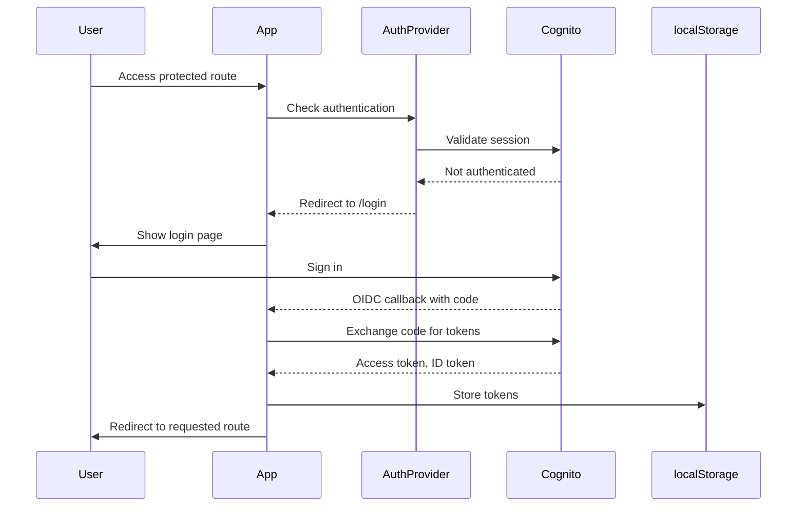

### Spelling Practice Workflow

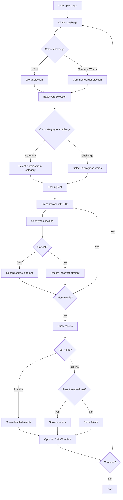

### Progress Tracking Workflow

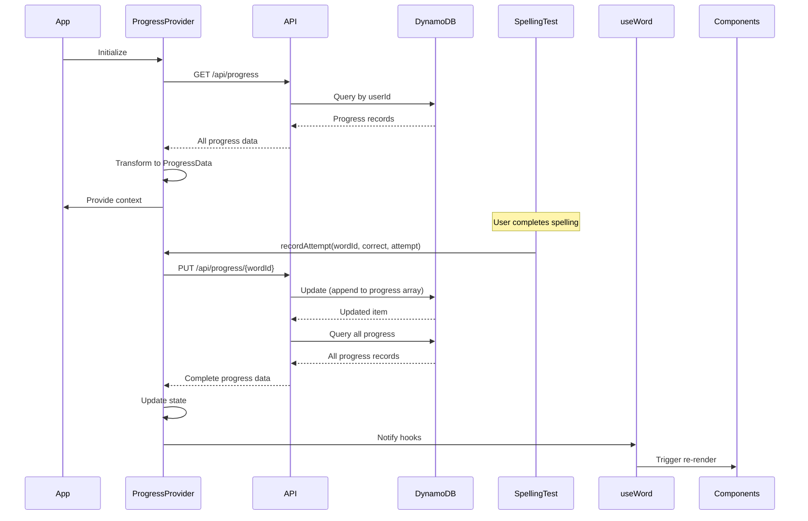

### Two-Stage Test Workflow (less_family words)

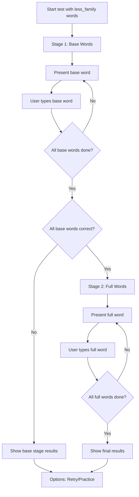

### Mastery Calculation Workflow

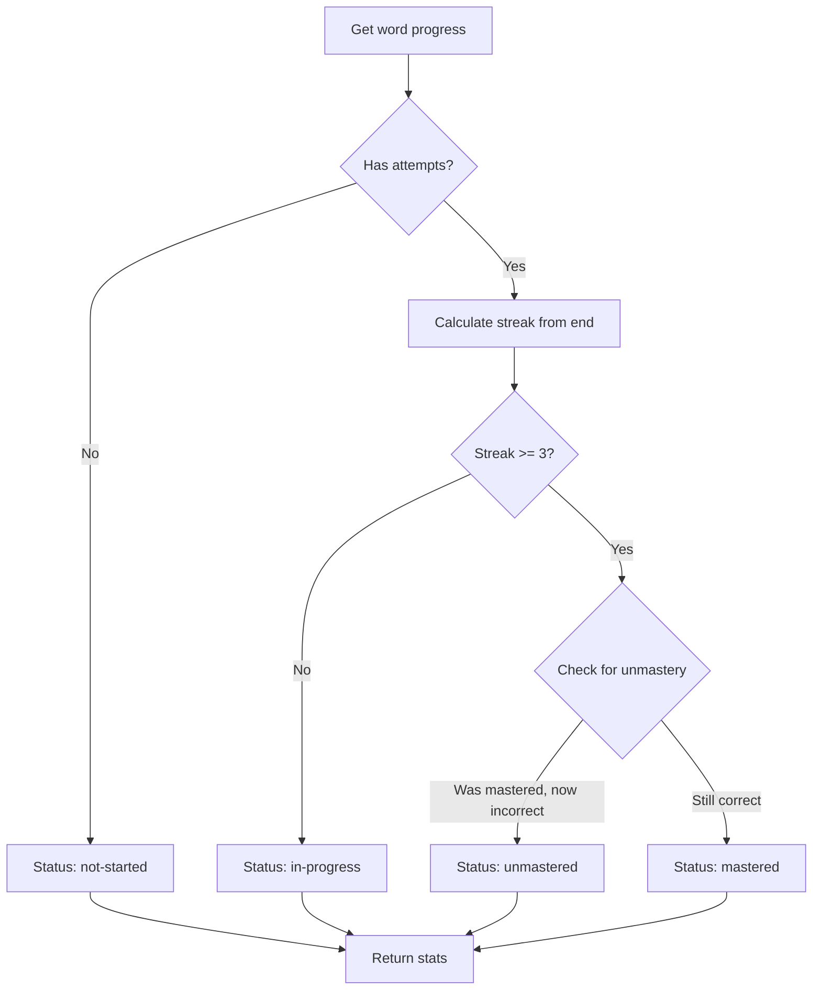

## System Workflows

### Application Initialization

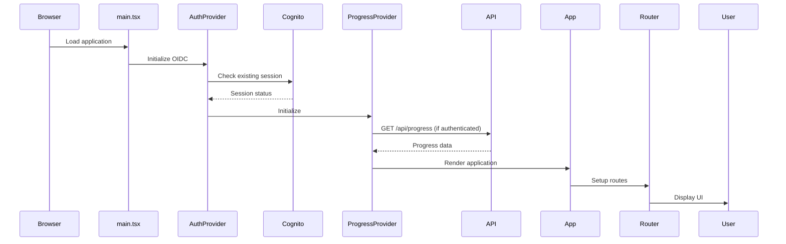

### Word Selection Workflow

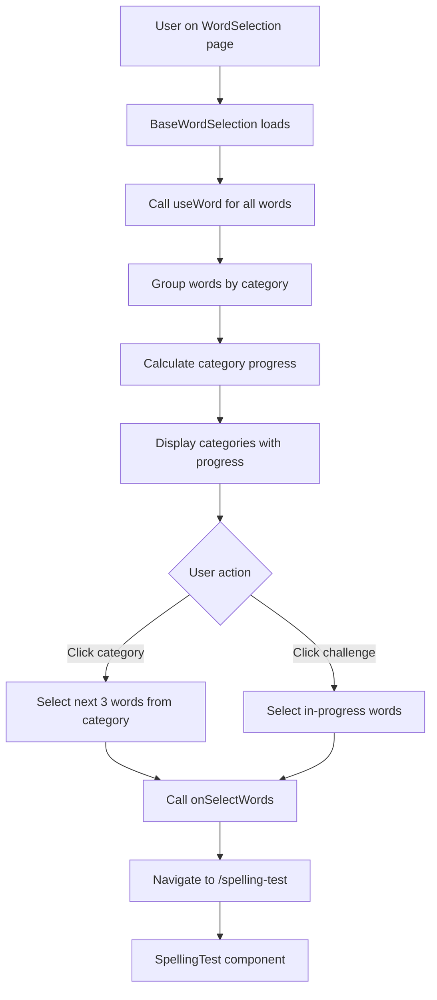

### Challenge Progress Calculation

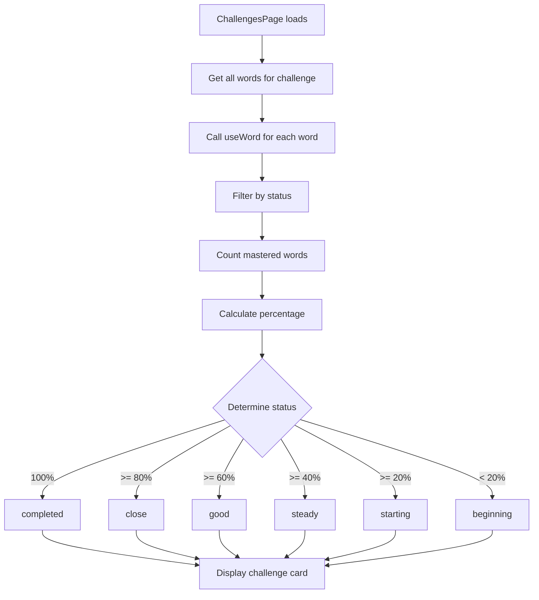

## API Workflows

### GET Progress Workflow

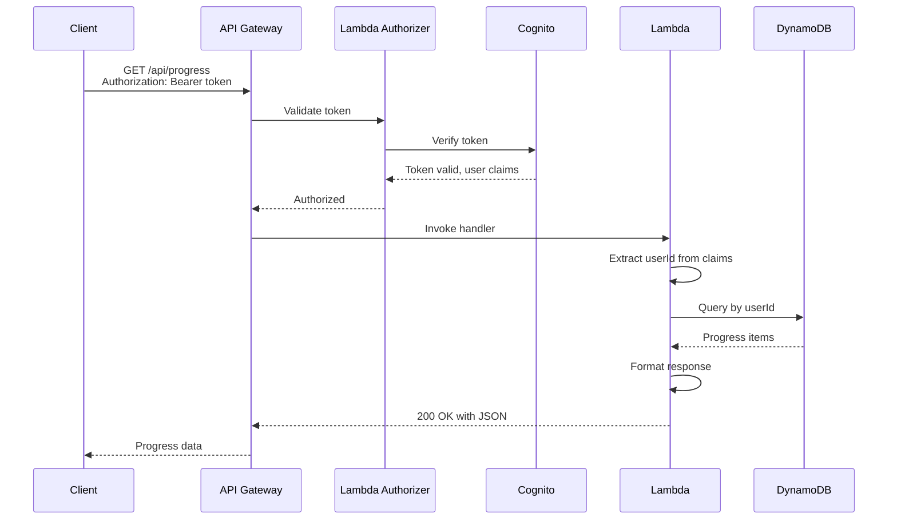

### PUT Progress Workflow

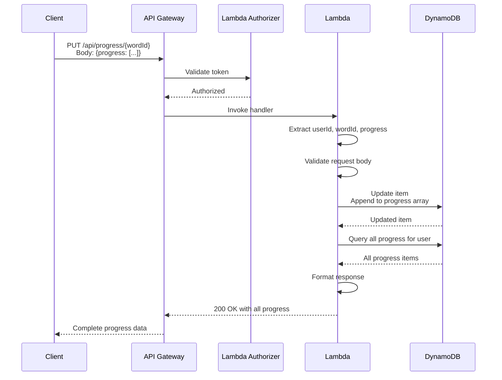

## Error Handling Workflows

### Authentication Error Flow

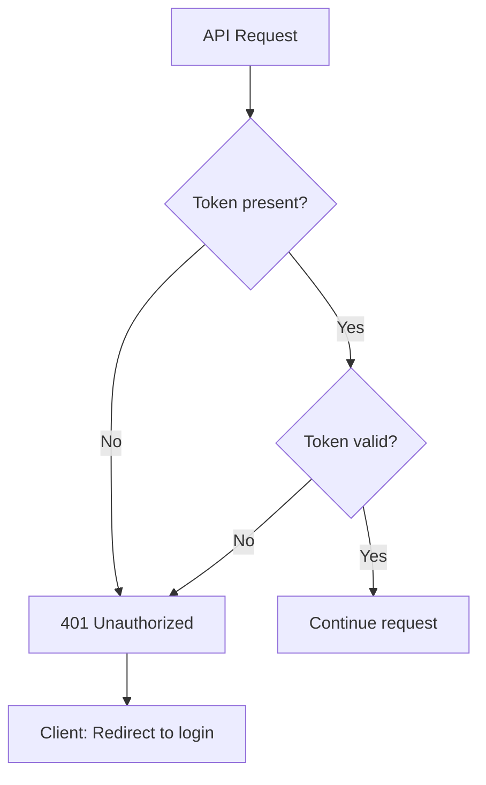

### API Error Flow

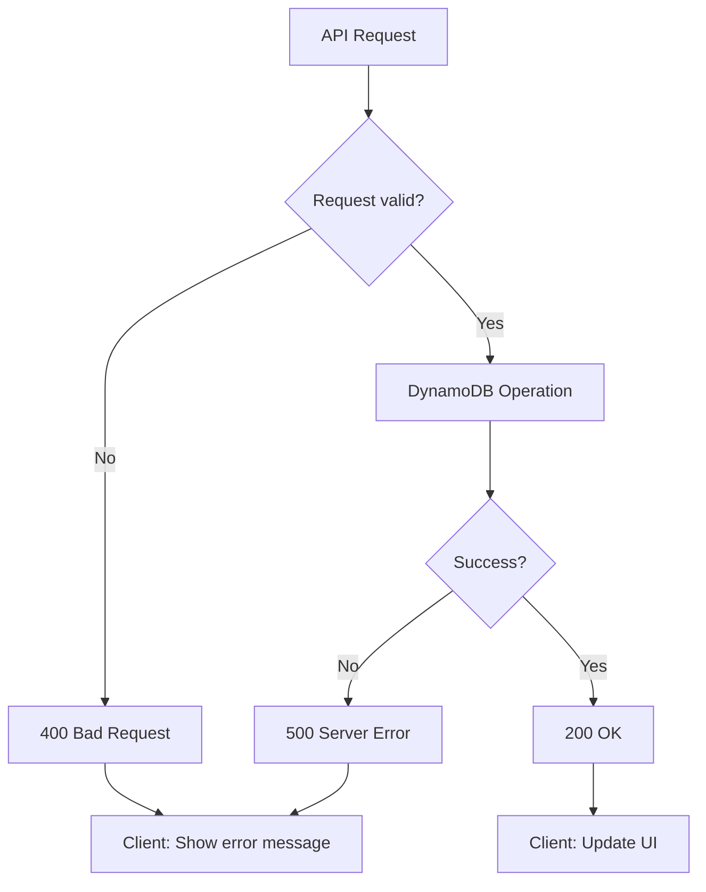

## Data Synchronization Workflow

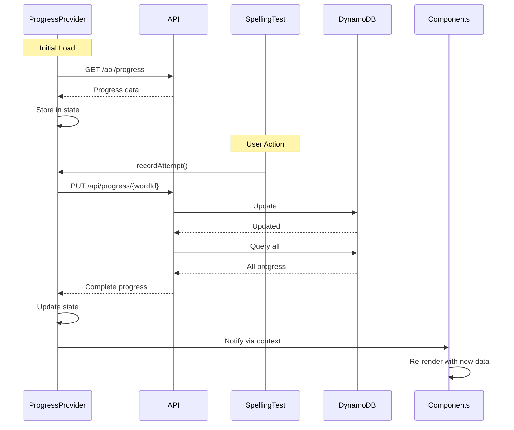

## Token Refresh Workflow

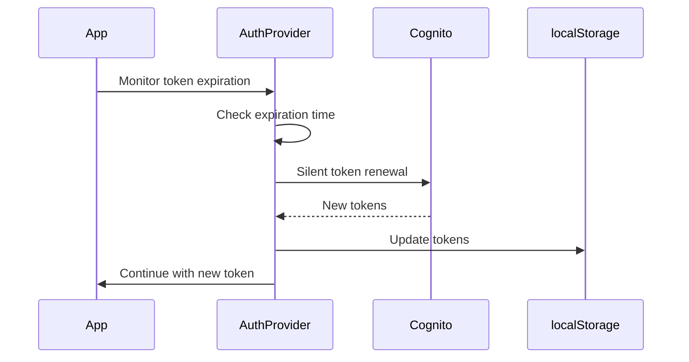

