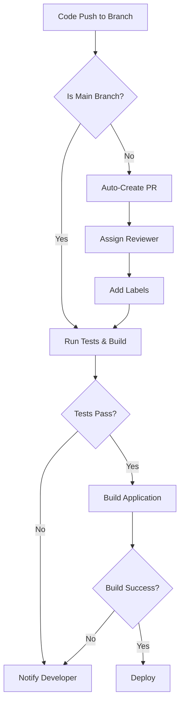
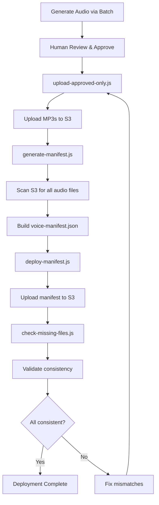

# Key Workflows and Processes #workflow

## User-Facing Workflows #react

### Spelling Practice Workflow

### Authentication Workflow

## Voice Generation Workflows #voice-tool

### Batch Audio Generation Workflow

### Human Review Workflow

### S3 Deployment Workflow

## Development Workflows

### Voice Tool Development Workflow

### Frontend Development Workflow

## Error Handling Workflows

### API Error Recovery Workflow

### File System Error Recovery

## Data Flow Workflows

### Audio Playback Data Flow (Updated with VoiceService)

```mermaid
sequenceDiagram
    participant U as User
    participant ST as SpellingTest
    participant VS as VoiceService
    participant M as Voice Manifest
    participant CDN as CDN/S3
    participant TTS as Browser TTS
    
    U->>ST: Start Test / Next Word
    ST->>VS: speak(word)
    VS->>M: Load manifest (lazy, once)
    M-->>VS: Word → URL mapping
    VS->>VS: Look up word in manifest
    
    alt MP3 Available
        VS->>CDN: Fetch audio file
        CDN-->>VS: MP3 data
        VS->>U: Play audio
    else MP3 Not Found
        VS->>TTS: speechSynthesis.speak(word)
        TTS->>U: TTS audio output
    end
```

### Progress Persistence Flow

## Integration Workflows

### Kiro CLI Integration Workflow

### CI/CD Workflow (Updated with Auto-PR)

### Voice Manifest Deployment Workflow (NEW)

## Monitoring and Maintenance Workflows

### Health Check Workflow

### Backup and Recovery Workflow

