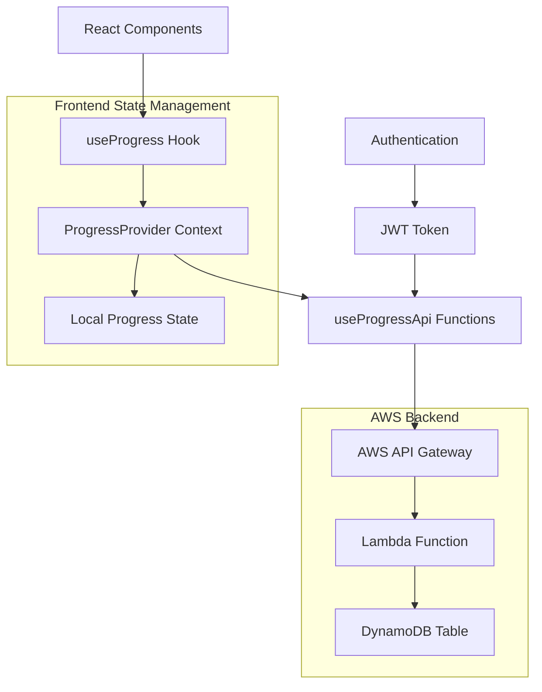
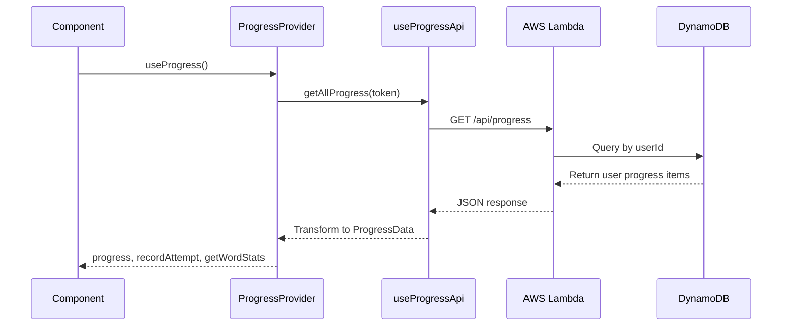
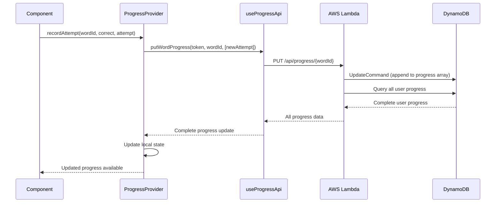

# Progress API Documentation

## Overview

The Progress API is a comprehensive system for tracking user spelling progress across the Spelling Website application. It provides persistent storage of user attempts, statistics calculation, and real-time progress updates through a React Context-based architecture.

## Architecture



## Data Flow

### 1. Progress Loading Flow


### 2. Recording Attempt Flow


## API Endpoints

### GET /api/progress
**Purpose**: Retrieve all progress data for authenticated user

**Authentication**: JWT Bearer token required

**Response Format**:
```json
[
  {
    "userId": "cognito-user-id",
    "wordId": "cat",
    "progress": [
      {
        "date": "2024-01-01T10:00:00.000Z",
        "correct": true,
        "attempt": "cat"
      },
      {
        "date": "2024-01-02T11:00:00.000Z", 
        "correct": false,
        "attempt": "kat"
      }
    ]
  }
]
```

### PUT /api/progress/{wordId}
**Purpose**: Record new attempt for specific word

**Authentication**: JWT Bearer token required

**Request Body**:
```json
{
  "progress": [
    {
      "date": "2024-01-03T12:00:00.000Z",
      "correct": true,
      "attempt": "cat"
    }
  ]
}
```

**Response**: Complete user progress (same format as GET)

## Data Models

### WordAttempt
```typescript
type WordAttempt = {
  date: string;      // ISO timestamp
  correct: boolean;  // Whether attempt was correct
  attempt: string;   // User's actual input
};
```

### ProgressData
```typescript
type ProgressData = Record<string, WordAttempt[]>;
// Maps wordId to array of attempts
```

### WordStats
```typescript
interface WordStats {
  status: 'not-started' | 'in-progress' | 'mastered' | 'unmastered';
  attempts: number;    // Total attempt count
  streak: number;      // Current consecutive correct answers
  lastSeen: string | null; // ISO timestamp of last attempt
}
```

## State Management

### ProgressProvider Context
The `ProgressProvider` manages global progress state and provides:

- **progress**: Current user progress data
- **recordAttempt()**: Function to record new attempts
- **getWordStats()**: Function to calculate word statistics
- **refreshProgress()**: Function to reload from API

### Local State Synchronization
- Progress loads automatically on authentication
- All updates go through API and refresh complete state
- Local state stays synchronized with backend
- Optimistic updates not implemented (API-first approach)

## Statistics Calculation

### Status Determination
```typescript
// Status logic in getWordStats()
let status = 'not-started';
if (attempts.length > 0) status = 'in-progress';
if (streak >= 3) status = 'mastered';

// Enhanced in useWord hook
const enhancedStatus = wasUnmastered ? 'unmastered' : stats.status;
```

### Streak Calculation
```typescript
// Calculate consecutive correct answers from end
let streak = 0;
for (let i = attempts.length - 1; i >= 0; i--) {
  if (attempts[i].correct) streak++;
  else break;
}
```

### Unmastered Detection
The system tracks when previously mastered words (3+ consecutive correct) become unmastered:

```typescript
// Check if word had 3+ streak but lost it
let consecutiveCorrect = 0;
let hadMastery = false;

for (let attempt of attempts) {
  if (attempt.correct) {
    consecutiveCorrect++;
    if (consecutiveCorrect >= 3) hadMastery = true;
  } else {
    if (hadMastery && consecutiveCorrect >= 3) {
      return true; // Was unmastered
    }
    consecutiveCorrect = 0;
    hadMastery = false;
  }
}
```

## Backend Implementation

### Lambda Function (Node.js 22)
- **File**: `/lambdas/progress.js`
- **Runtime**: Node.js 22 with ES modules
- **Authentication**: Cognito JWT via API Gateway authorizer
- **CORS**: Enabled for web application

### DynamoDB Schema
```
Table: spellingProgress
Partition Key: userId (String) - Cognito sub claim
Sort Key: wordId (String) - Word identifier
Attributes:
  - progress (List) - Array of attempt objects
```

### Key Operations

#### Query User Progress
```javascript
const params = {
  TableName: 'spellingProgress',
  KeyConditionExpression: 'userId = :uid',
  ExpressionAttributeValues: { ':uid': userId }
};
const result = await dynamo.send(new QueryCommand(params));
```

#### Update Word Progress
```javascript
const params = {
  TableName: 'spellingProgress',
  Key: { userId, wordId },
  UpdateExpression: 'SET progress = list_append(if_not_exists(progress, :empty_list), :new)',
  ExpressionAttributeValues: {
    ':new': progress,
    ':empty_list': []
  }
};
await dynamo.send(new UpdateCommand(params));
```

## Integration Points

### Authentication Integration
- Uses `react-oidc-context` for JWT tokens
- Cognito user ID extracted from JWT `sub` claim
- Automatic token refresh handled by OIDC library

### Component Integration
Components access progress through hooks:

```typescript
// Direct progress access
const { progress, recordAttempt, getWordStats } = useProgress();

// Word-specific access with enhanced stats
const wordData = useWord(wordId);
// Includes: status, attempts, streak, lastSeen, recordAttempt
```

### Usage Examples

#### Recording an Attempt
```typescript
const { recordAttempt } = useProgress();
await recordAttempt('cat', true, 'cat');
```

#### Getting Word Statistics
```typescript
const { getWordStats } = useProgress();
const stats = getWordStats('cat');
// Returns: { status: 'mastered', attempts: 5, streak: 3, lastSeen: '...' }
```

#### Using Enhanced Word Hook
```typescript
const wordData = useWord('cat');
// Includes all word info plus progress stats
console.log(wordData.status); // 'mastered' | 'in-progress' | etc.
console.log(wordData.attempts); // Array of attempts
```

## Error Handling

### Frontend Error Handling
- API failures logged to console
- Progress state remains unchanged on errors
- No user-facing error messages currently implemented

### Backend Error Handling
- Comprehensive error logging
- Proper HTTP status codes
- CORS headers included in error responses
- Graceful handling of missing data

## Performance Considerations

### Frontend Optimizations
- Single API call loads all user progress
- Local state prevents repeated API calls
- Context provider prevents prop drilling

### Backend Optimizations
- DynamoDB Query (not Scan) for user data
- Efficient list_append operations
- Minimal data transfer (only changed data)

### Potential Improvements
- Add retry logic for failed requests
- Consider pagination for users with many attempts
- Add caching layer for frequently accessed data

## Maintenance Operations

### Deduplication
The Lambda includes a deduplication function to clean up duplicate attempts:

```javascript
// Invoke with: { deduplicateAll: true }
// Removes duplicate attempts based on: attempt|correct|date
```

### Monitoring
- CloudWatch logs for Lambda execution
- API Gateway metrics for request patterns
- DynamoDB metrics for performance monitoring

## Security

### Authentication
- JWT tokens required for all operations
- Cognito integration ensures secure user identification
- No direct database access from frontend

### Authorization
- Users can only access their own progress data
- User ID extracted from authenticated JWT token
- No cross-user data access possible

### Data Privacy
- Progress data tied to Cognito user IDs
- No personally identifiable information stored
- CORS properly configured for web application domain

## Recent Changes

Based on recent commits, key improvements include:
- Enhanced error handling in voice generation workflow
- Improved path handling and progress management
- Updated AWS region configuration (eu-west-2)
- Streamlined documentation and removed outdated planning documents

## Future Enhancements

### Planned Improvements
- Add progress analytics and insights
- Consider real-time progress sharing features

### Scalability Considerations
- Monitor DynamoDB capacity as user base grows
- Consider implementing data archiving for old attempts
- Evaluate need for caching layer
- Plan for multi-region deployment if needed
